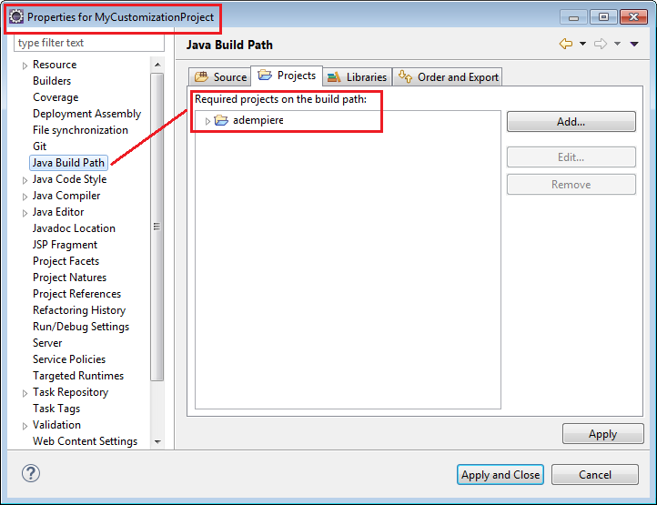
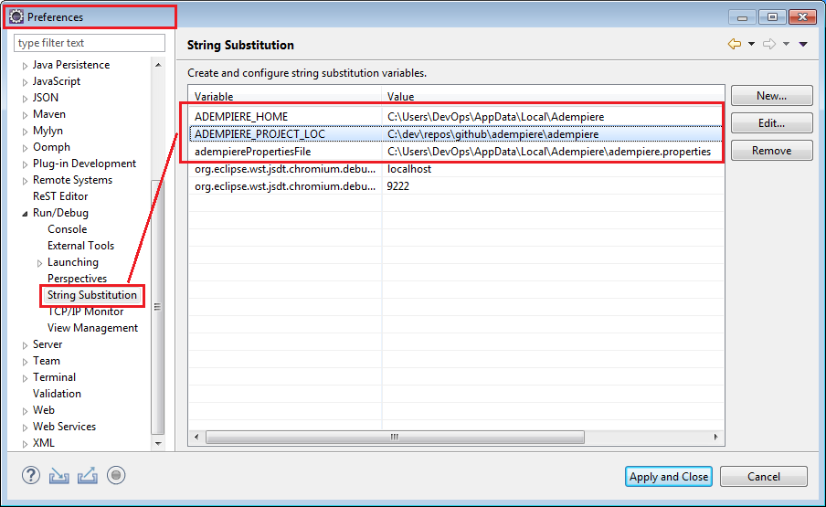
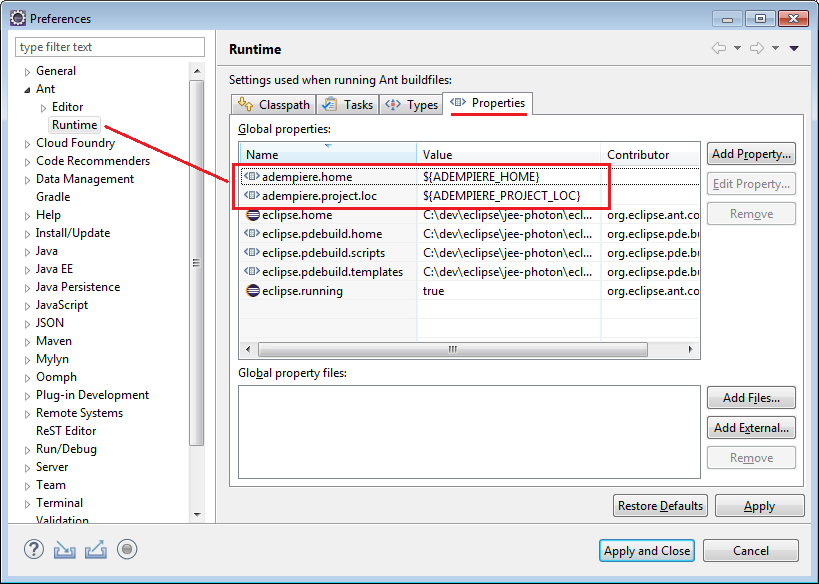
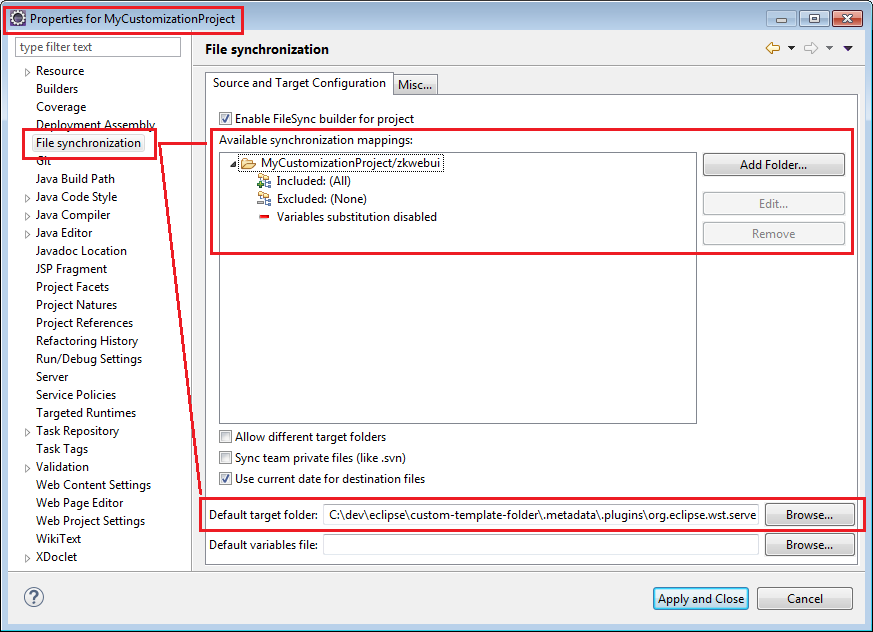
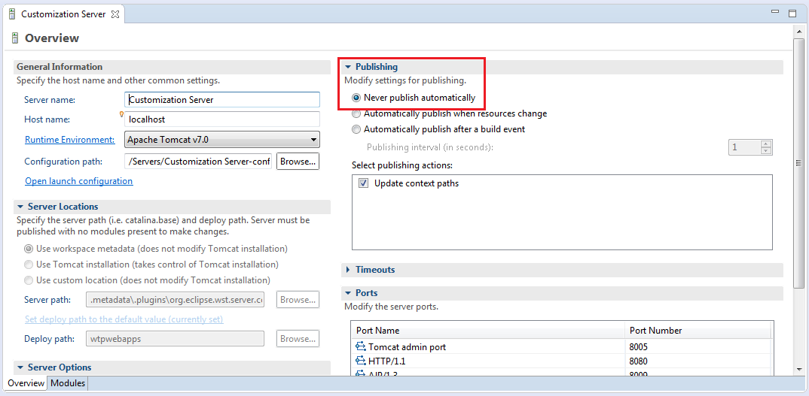

# Customization Environment

This tutorial will show you how to customize the ADempiere core software without making changes to the ADempiere project directly. Customization changes are instead included in customization.jar and zkcustomization.jar which can be deployed in the ADempiere install.

## Introduction

Sometimes you realize that ADempiere does not perfectly suit your needs and you need to make some changes to parts of the source code. Some customizations are not possible to achieve through ADempiere’s [Application Dictionary](http://wiki.adempiere.net/Application_Dictionary) and you have to modify the source code for that. The recommended way of customizing the software is to do it in a separate project. There you can create your customized classes and generate customization jar archives that can be added to ADempiere during the installation build.

## How to setup up your environment

You will need to have two projects in your development environment: one for the ADempiere project and one for your customized code that will become the new application and will depend on the ADempiere project. A Customization Template is provided to help you get started.

### Create the ADempiere Project

1. If you haven't already done so, follow the [ADempiere Version Control](../adempiere-version-control.md) process to fork, clone and checkout the target branch of the ADempiere project you wish to customize.
2. [Create your ADempiere development environment](./) and, if you are modifying the zk interface, [setup your WebUI Workspace using Eclipse Webtool](creating-webui-workspace-using-eclipse-webtool.md).
3. Build the ADempiere application \(using utils\_dev/build.xml\), install, setup the software \(to create the .properties file\) and import the database seed.
4. Modify the launch configurations as required and test that you can run the client and zk interfaces for the ADempiere project.

You now have the main ADempiere project created. Changes to this project should be made as part of the [Software Development Procedure](../software-development-procedure.md) to fix bugs, add features and generate common code that will be shared by all ADempiere implementations.

### Create the Customization Project

Fork the customization template project on GitHub from here: [https://github.com/adempiere/Customization-Template](https://github.com/adempiere/Customization-Template).

Add the forked code as a new project to your IDE workspace that contains the ADempiere project you created above.   Then, modify the _**Project Properties**_ to point at the main ADempiere project.



### Customization of the Swing Interface

For Swing, its pretty straight forward. Copy the source code you wish to customize from the main project, keeping the source directory structure the same. You can modify the code and then run the customization project to see the effects.  Many changes made while the code is running will be hot-swapped immediately.

### Customization of the ZK Interface

To help reduce the delays in starting Tomcat every time you make a change, there is a trick you can use based on an article on the [Beyond Java blog.](https://www.beyondjava.net/eliminate-cumbersome-tomcat-deployment-waits) Using a file synchronization tool, you can copy updated classes to the Tomcat server without having to reload the entire server. You may lose the state of the application but you will not have to wait for 30 seconds or more after every change for the server to restart.

Download and install the [FileSync Eclipse plugin](https://marketplace.eclipse.org/content/filesync).

In Eclipse, open the _**Window-&gt;Preferences**_ dialog and find the preferences for _**Run/Debug-&gt;String Substitution**_. Add a new variable and path as follows:



Next, make these variables available to the Ant build scripts by adding them to the _**Ant-&gt;Runtime**_ properties in the same _**Windows-&gt;Preferences**_ dialog.



Delete all the contents of the zkwebui folder in the template except for the build\_custom.xml file. The template contains one source file in zkwebui/WEB-INF/src, Login.java, as an example. This simply changes the heading on the login window to "My Customization Works!". If you wish, you can leave this file in place.

Copy the zkwebui directory from the ADempire project to the template. Be careful not to overwrite the build\_custom.xml file in the template. This will provide the same deployment structure as the main ADempiere project. \(This step is necessary and could be automated but risks overwriting your customization so it has been left as a manual process.\)

In the _**Project Properties**_ for the template, verify that the Deployment Assembly for the template project matches the Deployment Assembly in the ADempiere project.  


If you have doubts, simply copy the Deployment Assembly entries from the ADempiere project _.settings_/_org.eclipse.wst.common.component_  file to the same file in the template project.  Delete any _src_ directories that you won't be customizing and only keep the ones you will be using in the template.


Run the External Launcher _**MyCustomizationProject InitializeZKCustomizations**_ - this will copy all the classes needed from the ADempiere project to the template. Depending on the version of ADempiere, you may need to modify the associated build.xml file. \(If you do this by hand from the build file, don't forget to refresh the project files.\)

Create a server and add the template to the server following the [same process](creating-webui-workspace-using-eclipse-webtool.md#setup-the-webtool) as for the ADempiere project. Open the server properties and note the location where the project will be deployed.  This will typically be a folder like the following:

```text
C:\dev\eclipse\custom-template-folder\.metadata\.plugins\org.eclipse.wst.server.core\tmp1\wtpwebapps\MyCustomizationProject
```

In the project explorer, open the server folder and modify the context.xml file. Change the "context" tag to read

```text
<context reloadable="false">
```

This will prevent Tomcat from reloading the context/application every time there is a change.  It only affects the Eclipse Tomcat server and is not required on any production server.

Open the Project Properties and update the File Synchronization properties. Add the folder "MyCustomizationProject/zkwebui" as the source and set the target to the deployment location of the server. 



Publish the project to the server then, Open the server configuration and set the publishing setting to "Never publish".  Any changes made after this will be managed by the FileSync plugin.



### Testing with the Template

With the template setup you should be good to go. You may need to update the build files to adjust to ADempiere versions. If you customize other directories than build and client, also copy the build.xml files from the ADempiere project and modify them to add the customized classes to the jar files. Compare the build.xml from the base directory in both the template and the ADempiere project to see how and what to change.

If you launch the server, you should see the changes in the zk files. When you make a change, the file synchronization should publish this immediately and you will see the effects when you refresh the web page. You may lose the context and have to log-in again.

The launcher for the client will run the client as per the main project. Here, most changes you make will be hot-swapped into the application which is really nice for development.

## Exporting the Customization Jars

When your customization is ready, there is a launcher to build the customization jars. The two files customization.jar and zkcustomization.jar will be added to the lib directory. You can add these to the lib directory of a deployed ADempiere installation \(ADEMPIERE\_HOME/lib\) and execute the setup \(RUN\_Setup or RUN\_SilentSetup\) to see the changes.

