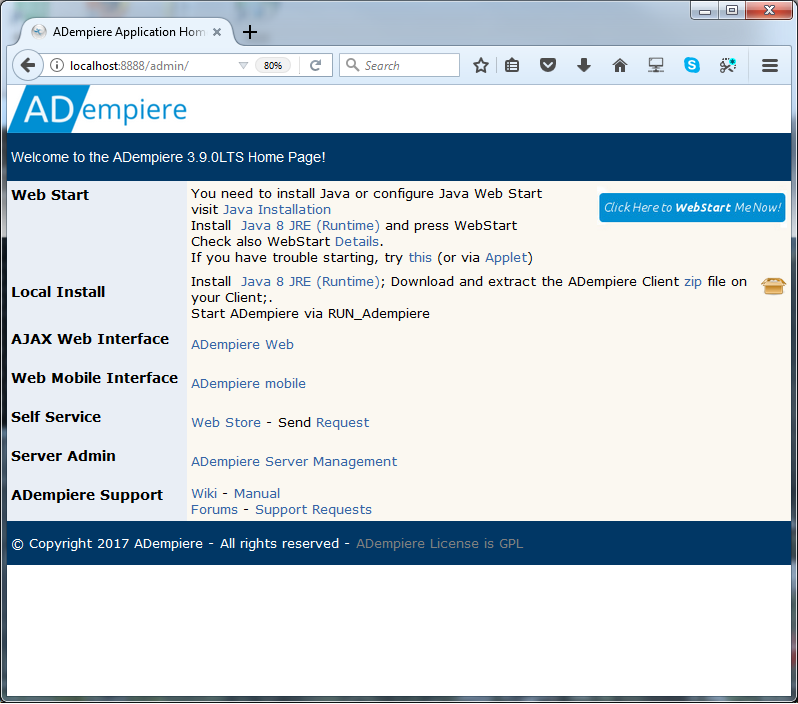
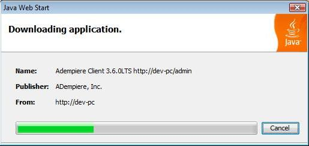

# User Guide

### About this Guide

The ADempiere Users Guide provides instructions and hints on the use of the software in day-to-day operation. It is intended as a reference on how to use the software to perform general functions. It includes configuration information where this is in the realm of the end-user. More complex configuration information can be found in the System Administration Guide or the Development Guide.

### About the ADempiere Application

ADempiere is a world-class ERP software application designed to support:

* **Multiple Organizations within the Enterprise**

  ADempiere can have multiple branch offices and companies in one single installation, making it especially attractive in large franchises where consolidation of financial and operational data is critical.

* **Multiple Languages across the Enterprise and its Customers**

  All user and customer-facing information can be presented in multiple languages. This, along with Multiple Organizations, makes Adempiere especially attractive for companies with branches in areas of different languages.

* **Multiple Accounting Formats**

  The accounting data can be managed and presented with multiple accounting schemas making the ADempiere application especially suited to the multi-national environment.

* **Multiple Operating Systems**

  Having been developed in Java, the applicaiton is able to run on most operating systems.

* **Complex Workflows**

  ADempiere provides workflows from simple documents, to multi-level approval and automated processing that can be fully customized to any business process.

The application supports all the main features and functions expected of an ERP system and allows for the customization of the software so company specific features can be easily added. As an end-user, you will likely be presented with a customized version of the software, specific to your business. Information on those customizations will be provided to you by your system provider or administrator. This guide covers the ADempiere application in its released configuration and uses the Garden World demo client for examples.

## Launching the Application

There are two ways of accessing the ADempiere Application: through a java software client that runs on the user's computer or through a web user interface \(webui\) which can be accessed through a browser. Both these applications communicate with the ADempiere Application Server. Which you use will be determined by your system implementation. In general, the two methods are similar and provide the same functionality. The Users Guide will focus on the Client software and will discuss the web version where it differs.

#### Launching the ADempiere Client using Web Start

To launch using Web Start, you will need the ADempiere Application Server URL. It may be provided as a link on your company's intranet or you can ask the System Administrator. It may look like [http://mycompany.com:8088/admin](http://mycompany.com:8088/admin).

Open the Application Server URL. It will look something like the following image.

The WebStart option automatically makes sure that the your computer will use the latest version of the ADempiere Client.

From the Application Server web page, click on the blue WebStart button and you will see the WebStart Dialog:

Note: If the application client does not start immediately after this, you may need to ask your System Administrator to ensure the java JNLP file is associated with the Java Web Starter application \(javaws\).

If a security window appears, click on "Always trust content from this publisher".

The very first time the application starts, you will see a license dialog. Accept the license terms.

The application client should start at this point and present a log in dialog.

