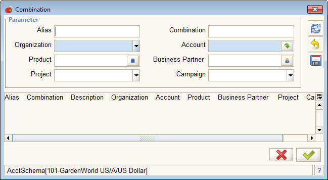

# Account Dialog

The **Account Dialog** provides a method to select an account from the Chart of Accounts and add [Accounting Dimensions](../../../glossary.md#accounting-dimension), effectively creating a "Combination" of dimensions that can be used to filter and sort accounting data in useful ways. The Combination is added to the list in the [**Account Combination**](https://adempiere.github.io/functional-guide/window/window-account-combination.html) _\*\*_window.

## Access

| Icon |   |
| :--- | :--- |
| Field: | [Account Field](../entering-data-fields-and-buttons/#account) |

## Restrictions

To see the fields where the this dialog can be accessed, your role must have _**Show Accounting**_ checked in the [**Role** ](https://adempiere.github.io/functional-guide/window/window-role.html)window.

In the Java Client, to see the Accounting Tabs where many of these fields are located, the [User Preferences](http://wiki.adempiere.net/index.php?title=User_Preferences&action=edit&redlink=1) must have **Show Accounting Tabs** checked.

## Description

The Account Dialog window will appear similar to the following. There are two parts to the dialog: the upper section where a "combination" is defined/created/edited and the lower section where the combination is selected and saved for use by the application.

In the upper panel, the number of fields depends on the number of [Accounting Dimensions](../../../glossary.md#accounting-dimension) in use. \(See also the **Account Combination**.\) If a combination was already defined in the originating field, the fields in the upper panel will contain the dimension information. To the right of these fields are three buttons:

| Icon | Function | Description |
| :--- | :--- | :--- |
|  | Requery | Clicking this button will find all combinations that use the dimension information. The combinations found will be listed in the lower panel. |
|  | Undo Changes | Clears the definition fields in the upper panel. |
|  | Save | Uses the definition fields to either create a combination and save it to the database or update an existing combination if a single one matches the definition fields. The saved/updated combination will appear in the lower panel. |

In the lower panel is a list of saved combinations that match the criteria in the upper panel.

At the very bottom are the two standard buttons Cancel and Confirm. Selecting a combination in the lower panel and clicking Confirm will save this combination in the originating [Account Field](http://wiki.adempiere.net/Entering_Data_-_Fields_and_Buttons#Account).

Clicking Cancel will delete the [Account Field](http://wiki.adempiere.net/Entering_Data_-_Fields_and_Buttons#Account) information.

In the window title bar, the name of the dialog and the icon shown will reflect the name and icon associated with the originating window and field.

At the bottom status bar is a reference to the Account Schema being used. On the bottom right is a indicator of the number of records found.

This dialog is opened from the Account Field when the information entered in the field does not match any or matches more than one combination OR if the button in the field was activated. To save an account combination back in the field, one must be selected from the lower panel list and the Confirm button clicked. If no suitable combination exists in the lower field, one can be created or a search performed using the upper panel.

## See Also

* [Accounting Dimensions](../../../glossary.md#accounting-dimension)
* [Account Field](../entering-data-fields-and-buttons/#account)
* [Combination](../../../glossary.md#combination)
* [Account Combination Window](https://adempiere.github.io/functional-guide/window/window-account-combination.html)

