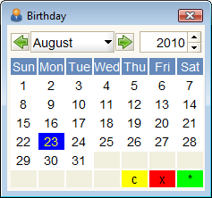
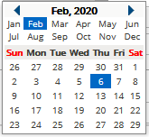
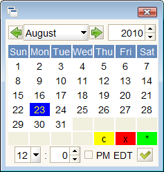

# Calendar Tool

## Calendar

The Calendar Tool provides a calendar to set dates and times.

###  Access

| Access via ... | By using ... |
| :--- | :--- |
| Icon: |   |
| Menu: | **Tools -&gt; Calendar** |
| Short Cut: | \(none\) |
| Menu Tree:  | \(none\) |


The calendar can also be enabled anytime you are entering date data by clicking on the calendar icon  in the date field.


###  Restrictions

* Dates from 1 January 1900 to 31 December 2100 are allowed.
* The timezone can't be set.
* Double click speed is hard-coded to 1 second.

###  Description

The Calendar tool provides a method to find dates using a standard month calendar. There are two forms of the Calendar tool, date only or date and time, as shown below.  

| Format | Java Client | Web  |
| :--- | :--- | :--- |
| Date |   |   |
| Date + Time |   | The Web interface uses a separate field for the time element. |

Which form appears depends on the data type of the field being entered. The menu link and most date fields are [date only](../entering-data-fields-and-buttons/date-field.md). The time portion will appear if the data type is set to [date & time \(time stamp\)](http://wiki.adempiere.net/Entering_Data_-_Fields_and_Buttons#Date.2BTime).

The Web version of the control is much simpler and only allows selection of a date.

Using the Java Client Calendar tool is easy. Use the controls to select the month and year and then **double click** the date. For the date/time version, there is also a handy check mark icon which you can click.

There are three icons to assist you:

*  C - Clear - will clear the date in the date field
*  x - Cancel - close the Calendar tool, making no changes
*  \* - Today - set today's date

The following keyboard controls can be used:

*  &lt;Pg Dn&gt; will increment the month
*  &lt;Pg Up&gt; will decrement the month
*  &lt;Up Arrow&gt; will decrement by a week
*  &lt;Down Arrow&gt; will increment by a week
*  &lt;Left Arrow&gt; will decrement by a day
*  &lt;Right Arrow&gt; will increment by a day
*  &lt;Enter&gt; will close the Calendar tool, saving the date/time if the tool was opened from a field.
*  &lt;Esc&gt; will cancel the and close the tool.

###  See Also

* [Entering Data - Fields and Buttons](../entering-data-fields-and-buttons/)
* [Date Field](../entering-data-fields-and-buttons/date-field.md)
* [Date + Time Field](../entering-data-fields-and-buttons/date-+-time-field.md)

