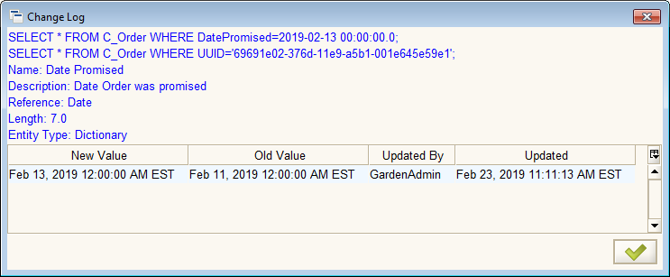

# Change Log or Record Info

The Change Log or Record Info dialog displays information about the records and changes to a particular field or all fields. The top part of the dialog contains information about the field or tab of interest. The bottom part is a table listing the changes.

The Change Log is accessed:

| For a ... | By ... |
| :--- | :--- |
| Field | Clicking " Change Log" in the pop-up menu for the field |
| Window Tab | Clicking the record count in the very bottom right of the window. |

## Restrictions

The Change Log entry will appear in the pop-up menu for most fields but the change log will only be kept for certain windows and fields.

Changes will only be recorded if made by a user with a Role having _**Maintain Change Log**_ selected.

Further, only users with a Role that has the _**Preference Level**_ set to _Client Preference_ will be able to see the changes in Change Log.

## See Also

* Entering Data - Fields and Buttons
* **Change Audit** window
* **Table and Column** window

