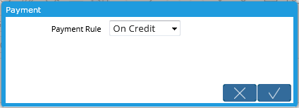
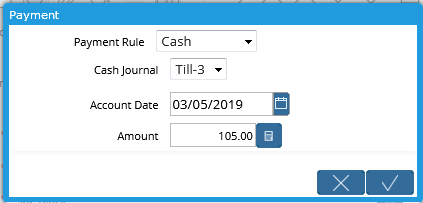
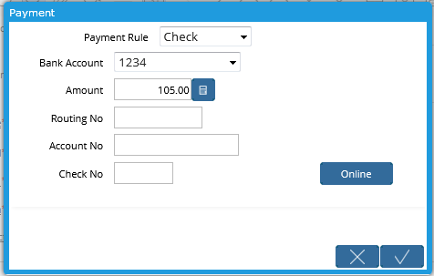
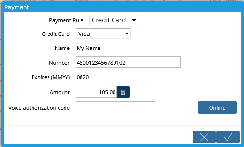
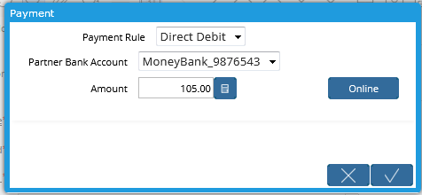
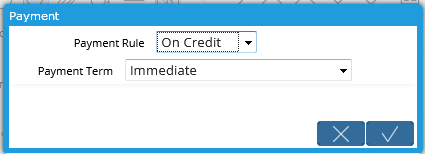

# Payment Dialog

The **Payment Dialog** provides a convenient way to complete a payment from a **Sales Order** or **Invoice**. It is accessed by clicking on the button for the Payment Rule which can have a number of labels but will have a payment icon such as  or .


A Payment Rule is simply a description of how the order or invoice will be paid, for example, by cash, check or credit card.


This convenience is useful for sales that don't use a Point of Sale terminal and where payments are collected immediately when the order or invoice is created. It can also be used to pay Vendor Invoices. It saves the steps involved in opening the **Payment** window and filling out the fields.

The button will also appear on Purchase Orders but will be limited to changing the Payment Rule on the Purchase Order.


This is a simple dialog intended for simple cases. It is not recommended it be used to collect payments to settle a customer account, pay multiple invoices or for complex payment terms with payment schedules.


### Restrictions

There are some restrictions:

* The Payment Rule button is only accessible on Order or Invoice documents.
* The Business Partner on the Payment will be the same as on the Order or Invoice so you can't use the button to take a payment for any customer.
* The Payment Rule dialog will not open if the document status is Voided or Reversed.
* If the document status is Completed or Waiting Payment and the _**Grand Total**_ field has a non-zero value, a Payment can be generated. Otherwise, only the Payment Rule can be changed.
* Only the Payment Rule can be changed on Purchase Order documents.
* The payment amount shown may not be accurate.  The payment amount shown in the dialog only looks at the base document  and does not consider the state of the Business Partners credit status or balance owing.  Payments made that do not reference this order or invoice may not be considered.

## Description

### Setting the Payment Rule

The Payment Dialog appears as a button, as shown above, displaying the payment icon \(or  \)and labeled with the currently selected method of payment.

Clicking the button will open the Payment Dialog. If the source document is not Completed or Waiting Payment and not yet able or ready to accept payment, the Payment Dialog will appear as a combo box listing various payment rules or methods.

The Payment Methods in the combo box may vary depending on your setup but generally contain the following values:

* Cash
* Credit Card
* Direct Deposit \(appears on purchase orders/vendor invoices\)
* Check
* On Credit
* Direct Debit \(appears on sales orders/customer invoices\)

Selecting one of these Payment Methods will set the Payment Rule in the document to that value meaning the text on the Payment Rule button will change.

Below the combo box, there are two buttons:

*   Cancel - this will close the dialog.
*  Confirm - this will save the Payment Rule value.

## Taking a Payment

If the source document status is Completed or Waiting Payment, the Payment Rule button can be used to create and complete a payment. If a single invoice is involved, either as the source document or if related to the source Order, the payment will be allocated against the invoice.


The Payment Rule button can be clicked multiple times and will create a new payment each time. This is useful for mixed payments where, say, the customer wants to pay a portion by cash and the balance by credit card.


The _**Amount**_ field that appears will display the "unpaid" amount. This is calculated as follows:

* For an Order, If no Invoices are associated with the Order, the Amount will be the _**Grand Total**_ of the Order less any payments made towards that Order.
* Otherwise, the Amount will be the Invoice Open Amount less any unallocated payments made towards the Order where the Order is the source document for the dialog or referenced directly from the Invoice if the Invoice is the source document.

Some payment methods can be processed online if a suitable payment processor has been configured to manage the online transactions. If a payment processor has not been configured, the online button will not function and a error will be displayed if it is clicked. Without an online process, some manual care is required to ensure that the payment record will match the actual payment.

If the payment process was successful, a dialog will appear with the message "Created Payment: &lt;Payment Document No&gt;". If there was an error, an error message will be displayed.


In most cases, if there is an error, no payment is created. However, in the case where the online process succeeds but the system payment cannot be completed, the payment will be left as draft so that the user can troubleshoot the problem.


### **Cash**

Selecting the Payment Rule _Cash_ will display the window shown below.

The Cash Payment requires

| Field | Description |
| :--- | :--- |
| _**Cash Journal**_ | The Cash Journal where the resulting payment will be recorded. |
| _**Account Date**_ | The date of the accounting consequences.  This will also be used as the date of the transaction.  The date may be different than the date of the source document.  The default is the current date. |
| _**Amount**_ | The remaining unpaid amount for this document.  Note the restrictions and warnings above. |

On clicking Confirm \(\), a cash payment will be created, completed and added to the selected Cash Journal. If possible, the payment will be allocated towards an invoice.

### **Check**

If _Check_ is selected in the Payment Rule combo, the Payment Dialog will appear as shown below.

The Check Payment fields require the following

| Field | Description |
| :--- | :--- |
| _**Bank Account**_ | The bank account where the check will be deposited. |
| _**Amount**_ | The amount of the payment. |
| _**Routing No**_ | The routing number of the source bank from the check. This is generally just used for reference but may be used in online processing. |
| _**Account No**_ | The account number from the check.  Again, used for reference. |
| _**Check No**_ | The check number.  Used for reference. |


The system can be configured to overwrite the payment document number with the check information. For a receipt, the resulting document number will look like : "&lt;Routing No&gt;: &lt;Account No&gt; &lt;Check No&gt;. For payments, the outgoing check number will be used.


On clicking  Confirm, the payment information will be saved and allocated to the invoice if possible.

### **Credit Card**

If _Credit Card_ is selected in the Payment Rule combo, the Payment Dialog will appear as shown below.

Select the appropriate credit card type from the combo box and fill in the other text fields.

The Credit Card fields require the following

| Field | Description |
| :--- | :--- |
| _**Credit Card**_ | Select the credit card type.  These are configured and associated with Bank Accounts.  The list will only include Credit Cards that are accepted |
| _**Name**_ | The card holder name as it appears on the card |
| _**Number**_ | The card number |
| _**Expires \(MMYY\)**_ | The credit card expiry month and year using the four character MMYY format |
| _**Amount**_ | The amount of the payment |
| _**Voice Authorization Code**_ | When the credit card payment is taken manually and a phone authorization code is received, the code can be entered here for reference. |

Clicking the "Online" button will attempt to process the credit card information online through the associated payment processor.

### **Direct Debit / Deposit**

If _Direct Debit_ or _Direct Deposit_ is selected in the Payment Rule combo, the Payment Dialog will appear as shown below. The term debit / deposit will be used with sales orders / purchase orders respectively.

The required fields are:

| Fields | Description |
| :--- | :--- |
| _**Partner Bank Account**_ | For Direct debits and deposits, a target bank account is required.  This is defined in the **Business Partner** window, **Bank Account** tab. |
| _**Amount**_ | The amount of the payment. |

Clicking the Online button will attempt to process the payment online if a suitable payment processor is configured.

Clicking the confirm button will simply create a payment record but will not process the payment online.

### **On Credit**

The On Credit payment will only update the payment terms of the order or invoice. No payment is created.

