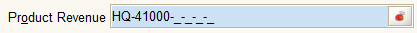

# Account Field

Icons:   

The Account field displays the details of a selected set of [Accounting Dimensions](../../../glossary.md#accounting-dimension) referred to as a [Combination](../../../glossary.md#combination).  It is usually found on Accounting tabs which provide accounting information related to the parent tab.

The field shows a text value with the Accounting Dimensions separated by a hyphen.  Dimensions that have not yet been set have an underscore as a place holder.  When the Combination is used to post Accounting Facts, the values of the Dimensions will be drawn from the posted document, overwriting the placeholders and other values in the Combination and the final Combination will be used to create the Accounting Fact.  The account number dimension is not overwritten. 

To set a Combination, you can type in a text value or you can click on the helper button.  The text that is entered will be assessed as follows:

* If the text is null, zero length or equals "%" - the wild card - , the [Account Dialog](../dialogs-and-forms/account-dialog.md) will be opened.
* If the text does not end with a percent sign "%", one is added as the last character.
* The software then looks for a valid combination where the alias or the combination string match the text
* If there is a single match, the field is filled with the valid combination.
* If there is no match or more than one match, the [Account Dialog](../dialogs-and-forms/account-dialog.md) is opened.

The Account Icon \(\) can also be pressed to activate the [Account Dialog](../dialogs-and-forms/account-dialog.md). A combination selected in the Account Dialog will be displayed once the dialog is confirmed and closed. If the Account Dialog is canceled, the Account field will be cleared.

The pop-up menu \(mouse right-click\) will display the following entry:

*  [Change Log](http://wiki.adempiere.net/Change_Log)

