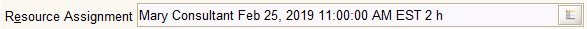

# Assignment Field

Icon:  

The Resource Assignment field provides a way to assign resources to schedule slots. If a resource assignment exists, the field will show the resource name, the date of the assignment and the number of slots used or it will display the resource assignment ID.

The Assignment field is typically found on the **Sales Order** window on the **Order Line** tab.

There is no way to enter data directly in the field. You have to use the helper functions. Clicking the Assignment helper function \(  \) will do the following:

* If the Assignment field is blank, it will open the [Schedule Info](http://wiki.adempiere.net/Schedule_Info) window where you can double-click on a the starting schedule slot. The double-click will open the [Resource Assignment Dialog](http://wiki.adempiere.net/Resource_Assignment_Dialog) which displays information about the assignment.
* If the assignment already exists, the [Resource Assignment Dialog](http://wiki.adempiere.net/Resource_Assignment_Dialog) will open directly.

Confirming and closing the [Resource Assignment Dialog](http://wiki.adempiere.net/Resource_Assignment_Dialog) will save the assignment to the Assignment field. Canceling the Resource Assignment Dialog will clear the Assignment field.

The pop-up menu \(mouse right-click\) will display the following entries:

*  Resource Info
*  Change Log

For more information see:

* Schedule Info
* Resource Info
* Resource Assignment Dialog

