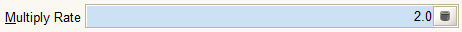

# Number Field

Icon:  

Number fields provide a way to enter and display numeric values. There are several types:

* Amounts
* Costs + Prices
* Integers and
* Quantities

The default number field has a maximum of 28 digits in the integer part and 12 digits in the fractional part. The default presentation is as a float number with one digit after the decimal. The number of digits in the presentation varies with the type of field.

All the numeric fields use the [Calculator Tool](../dialogs-and-forms/calculator-tool.md) as the helper function. To access the Calculator, click on the Calculator icon \(  \).

The pop-up menu displays the following options:

*  [Value Preference](http://wiki.adempiere.net/Value_Preference_Dialog)
*  [Change Log](http://wiki.adempiere.net/Change_Log)

