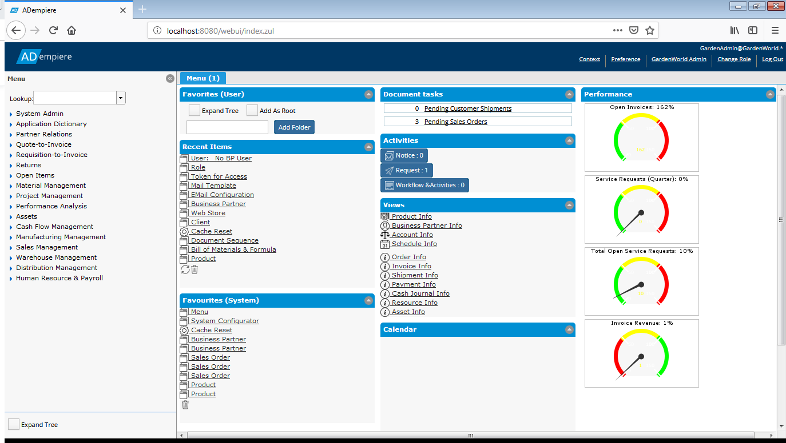
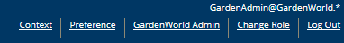
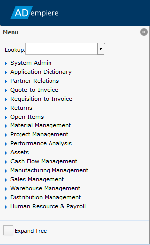
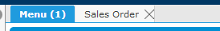

# Finding Your Way Around the Web App

After you login, you will be presented with a dashboard which can be configured to show a variety of information.

## The User Panel

At the top right is the User Panel. This small panel shows the User ID of the current user and the Client and Organization they are logged-in to, in this case GardenAdmin, GardenWorld and all Organizations \(\*\). Below that are five links that provide some useful information and actions:

| Clicking the link ... | Opens ... |
| :--- | :--- |

| Context | A Context dialog showing the full context of the application. The context is useful for developers and system administrators. If you are having issues with a particular window, the context may provide the Support Team valuable help. |
| :--- | :--- |

<table>
  <thead>
    <tr>
      <th style="text-align:left">Preference</th>
      <th style="text-align:left">
        
A small dialog where a few preferences can be set. These are:

        <ol>
          <li>Automatic Commit - If not selected, a dialog will ask if you want to save
            changes before moving to another record. If selected, the changes will
            be performed automatically.</li>
          <li>Automatic New Record - If selected, if a window is opened or a search
            performed and no record is found, a new record will be opened automatically
            if possible.</li>
          <li>Window Tab Collapsible - To save screen space, the tabs on the side of
            a Window can be collapsed.</li>
          <li>Window Tab Placement - The tabs can be on the right or left.</li>
        </ol>
        
Click the Save icon at the bottom right to save the Preferences. You will
          have to log out and in for the changes to have effect.

      </th>
    </tr>
  </thead>
  <tbody></tbody>
</table>| Change Role | Closes all windows and effectively logs out, returning the user to the Login Role dialog. This provides a quick way to change the current Role, Client, Organization or Warehouse. For the Super User, its a great tool. For a user with access to only one of each, not so much. |
| :--- | :--- |

| Log Out | Closes all windows and logs out, returning the user to the Login dialog. |
| :--- | :--- |

On the left is the Menu which a tree of all the available Windows, Reports and Processes the User has access to. The tree can be quite large and contain hundreds of items but it can be customized to each role and only show the entries required.

At the top of the menu is a Lookup combo box that can be used to find a particular menu item. At the bottom is a checkbox that will expand the entire tree if it is selected.

The Menu is always visible but it can be collapsed to the left by clicking on the small button \(\) in the top right of the Menu.

## Window Tabs

To the right of the Menu are the Window Tabs, or just Windows. The Menu Tab, shown in the image as "Menu \(1\)", is the Dashboard for the User. Other Menu Items opened, such as the Sales Order Window, will appear as additional Tabs. Any Window can be closed by closing its Tab \(clicking on the X in the Tab\). It is not possible to Close the Menu Tab. Clicking the Window Tab will bring it to the fore.

