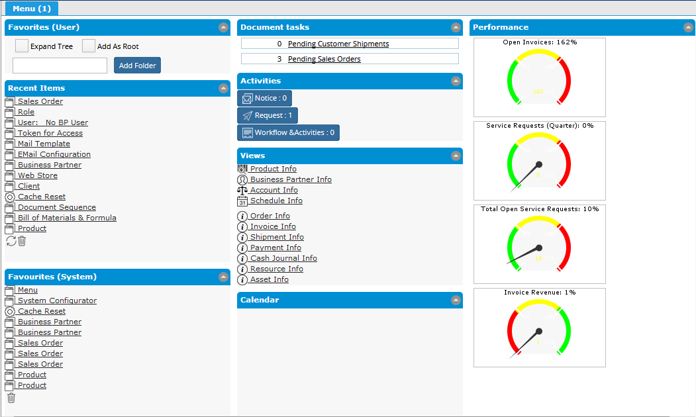
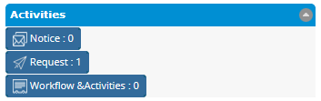
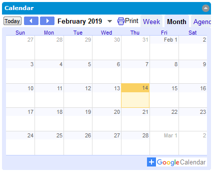
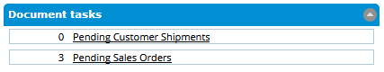
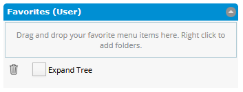
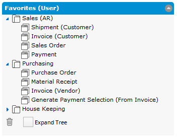

# The Dashboard

The Dashboard can contain a variety of Panels that provide information such as:

* [Activities](untitled.md#activities);
* [Calendar](untitled.md#calendar);
* [Document tasks](untitled.md#document-tasks);
* [Favorites \(User\)](untitled.md#favorites-user);
* Favorites \(System\);
* Performance measures;
* Recent Items; and 
* Views


Access to Dashboard Items has to be specifically granted for each Role by a Client Administrator. If no access has been granted for the Role chosen at login, the Dashboard will be blank.


Each panel has a header bar and can be collapsed to make room on the screen.

## Activities

The Activities panel has three buttons that provide some of the key information about the tasks that must be accomplished. Beside the text in each button is a number representing the number of items that need attention. The three buttons function as described below.

| Button ... | Opens ... |
| :--- | :--- |
| Notice | The **Notice** window which displays Client and Organization information the user may need.  Notices are raised by the system and may indicate problems that need to be addressed or information that needs to be managed.  The User can choose to receive these "Notes" via email, the **Notice** window or both.  Notices may have Attachments such as spreadsheets or reports relevant to the note. |
| Request | The **Request** window showing items that may require attention.  Requests are typically customer driven and can be for products, services or warranty action and may trigger the creation of other documents such as sales orders. |
| Workflow Activities | The **Workflow** window which shows any active workflows the user is involved with.  Workflows may require approvals or additional actions on the part of the user to complete the work. |


The Menu Tab text "Menu \(1\)" shows the total of the activities that need attention. The number will be updated as new items appear. Keep an eye out for it as you work and return to the Menu Tab to address these activities.


## Calendar

A Calendar can be displayed in the Dashboard. This is an embedded Google calendar which can be used to find dates and to add events to your personal calendar, although they will not appear in this panel.


The Calendar is not configurable. If you need the Calendar to show events, ask your System Administrator. A modification to the application code will be required.


## Document Tasks

The _Document tasks_ panel displays a count of documents with a particular status. Clicking on the link beside the number will open the corresponding window with the relevant documents loaded. The entries in this panel are set in the [**Document Status Indicator**](../../system-administration/managing-organizations/document-status-indicators.md) window. Its likely that the system administrator will set these up for you as it is an advanced task.

## Favorites \(User\)

The User Favorites panel is a list of frequently used menu items that you can select and organize as you wish. Clicking on items in the panel will open the associated menu item. Having these items easily available saves time when looking for a frequently needed menu item.

The pane, when empty, appears as shown in the image below.

You can add items to the Favorites by simply dragging them from the main menu and dropping them into the panel. You can create folders to organize the items by right-clicking in the panel or on an existing item and selecting "Add Folder" from the pop-up menu. The order and structure can be arranged by dragging and dropping items. An item dropped on another item will be placed after it. An item or folder dropped on a folder will cause a menu to appear with options to "Insert After" or "Move Into".

A Folder can be renamed by double-clicking on it. A simple text dialog will open. Edit the text and hit &lt;Enter&gt; to save the new name or close the dialog. Hit &lt;Esc&gt; to cancel.

Folders can also be set to Start Collapsed or Expanded by right-clicking the folder and selecting the corresponding menu entry from the pop-up menu.


The Folders will be created in the language you are using at the time. If you switch to a different language, the folder names will not be translated.


The trash can icon at the bottom of the panel can be used to delete items from the list. Simply drag items from the list and drop them on the trash can. You can also delete items using the right-click pop-up menu.

The Expand Tree check box can be used to expand or collapse the entire tree.

## Favorites \(System\)

Like the Favorites \(User\), the Favorites \(System\) is a list of menu items but these ones are common to all users of the Role.  Items from the menu can be added by dragging and dropping onto the list or deleted from the list by dragging to the trash can icon.

You can only delete the items that you have added.  Items added by other users cannot be deleted.

The items are displayed in the order they appear in the Menu and all at the same level.  


The Favorites \(System\) uses the same list as the Java Client Menu Bar.  However, the Favorites \(System\) panel includes items added from ALL users of the Role.  The Java Client Menu Bar will only show items added by the User.



If multiple users add the same menu item to the Favorites \(System\) or to the Java Client Menu Bar, the menu item will appear multiple times in the list. See issue [\#2355](https://github.com/adempiere/adempiere/issues/2355).


## Performance Measures

## Recent Items

## Views

