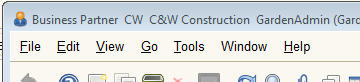

# The Application Menu

## The Application Menu  

The Application Menu appears at the top of most windows in the ADempiere Java Client. The number of menu items varies depending on the type of window currently open. Its structure is similar to most applications.

For reference, the following list contains all the options that will appear in the Application Menu:

<table>
  <thead>
    <tr>
      <th style="text-align:left">Icon</th>
      <th style="text-align:left">Menu</th>
      <th style="text-align:left">Short Cut Key</th>
      <th style="text-align:left">Description</th>
    </tr>
  </thead>
  <tbody>
    <tr>
      <td style="text-align:left"><b>File</b>
      </td>
      <td style="text-align:left"></td>
      <td style="text-align:left"></td>
      <td style="text-align:left"></td>
    </tr>
    <tr>
      <td style="text-align:left">
        
      </td>
      <td style="text-align:left">Print Screen</td>
      <td style="text-align:left"></td>
      <td style="text-align:left">Prints the current computer screen to the default printer.</td>
    </tr>
    <tr>
      <td style="text-align:left">
        
      </td>
      <td style="text-align:left">Screen Shot</td>
      <td style="text-align:left"></td>
      <td style="text-align:left">Copy the current window to the clipboard.</td>
    </tr>
    <tr>
      <td style="text-align:left">
        
      </td>
      <td style="text-align:left">Report</td>
      <td style="text-align:left"></td>
      <td style="text-align:left">Previews a report based on the current record. See <a href="http://wiki.adempiere.net/Report">Report</a> for
        more information.</td>
    </tr>
    <tr>
      <td style="text-align:left">
        
      </td>
      <td style="text-align:left">Print</td>
      <td style="text-align:left"></td>
      <td style="text-align:left">Prints a predefined report based on the current record. See <a href="http://wiki.adempiere.net/Printing_and_Print_Preview">Printing and Print Preview</a> for
        more information.</td>
    </tr>
    <tr>
      <td style="text-align:left">
        
      </td>
      <td style="text-align:left">Print Preview</td>
      <td style="text-align:left"></td>
      <td style="text-align:left">Displays a preview of a predefined report based on the current record.
        See <a href="http://wiki.adempiere.net/Printing_and_Print_Preview">Printing and Print Preview</a> for
        more information.</td>
    </tr>
    <tr>
      <td style="text-align:left">
        
      </td>
      <td style="text-align:left">Export</td>
      <td style="text-align:left"></td>
      <td style="text-align:left">Export all displayed records to an external spreadsheet (*.xls) file.
        Not just the current record, but all records in the current window. The
        number of records can be adjusted by the <a href="http://wiki.adempiere.net/Lookup">Lookup</a> function.</td>
    </tr>
    <tr>
      <td style="text-align:left">
        
      </td>
      <td style="text-align:left">eXit Window</td>
      <td style="text-align:left"></td>
      <td style="text-align:left">Close the current window. In the main application window, this will close
        the application.</td>
    </tr>
    <tr>
      <td style="text-align:left">
        
      </td>
      <td style="text-align:left">Log Out</td>
      <td style="text-align:left"></td>
      <td style="text-align:left">Log out of the application and open the log-in screen</td>
    </tr>
    <tr>
      <td style="text-align:left">
        
      </td>
      <td style="text-align:left">Exit Application</td>
      <td style="text-align:left"></td>
      <td style="text-align:left">Exit the application entirely.</td>
    </tr>
    <tr>
      <td style="text-align:left"><b>Edit</b>
      </td>
      <td style="text-align:left"></td>
      <td style="text-align:left"></td>
      <td style="text-align:left"></td>
    </tr>
    <tr>
      <td style="text-align:left">
        
      </td>
      <td style="text-align:left">New Record</td>
      <td style="text-align:left"></td>
      <td style="text-align:left">Creates a new record. Required fields will have red backgrounds which
        turn to blue once they are filled.</td>
    </tr>
    <tr>
      <td style="text-align:left">
        
      </td>
      <td style="text-align:left">Save changes</td>
      <td style="text-align:left"></td>
      <td style="text-align:left">Saves any changes to the current record.</td>
    </tr>
    <tr>
      <td style="text-align:left">
        
      </td>
      <td style="text-align:left">Copy Record</td>
      <td style="text-align:left"></td>
      <td style="text-align:left">Creates a copy of the current record. Only the record is copied, not the
        lower level tabs.</td>
    </tr>
    <tr>
      <td style="text-align:left">
        
      </td>
      <td style="text-align:left">Delete Record</td>
      <td style="text-align:left"></td>
      <td style="text-align:left">Deletes the current record.</td>
    </tr>
    <tr>
      <td style="text-align:left">
        
      </td>
      <td style="text-align:left">Delete Selected Records</td>
      <td style="text-align:left"></td>
      <td style="text-align:left">Opens a dialog where a subset of the records can be selected for deletion.</td>
    </tr>
    <tr>
      <td style="text-align:left">
        
      </td>
      <td style="text-align:left">Undo Changes</td>
      <td style="text-align:left"></td>
      <td style="text-align:left">Reverts the changes made and returns the record to the state after the
        last save.</td>
    </tr>
    <tr>
      <td style="text-align:left">
        
      </td>
      <td style="text-align:left">Requery</td>
      <td style="text-align:left"></td>
      <td style="text-align:left">Requeries the data according to the current search criteria. Useful if
        changes have been made in other windows.</td>
    </tr>
    <tr>
      <td style="text-align:left">
        
      </td>
      <td style="text-align:left"><a href="http://wiki.adempiere.net/Lookup">Lookup Record</a>
      </td>
      <td style="text-align:left"></td>
      <td style="text-align:left">Opens the <a href="http://wiki.adempiere.net/Lookup">Lookup</a> dialog where
        search criteria can be defined.</td>
    </tr>
    <tr>
      <td style="text-align:left">
        

          
        

        

          
        

      </td>
      <td style="text-align:left"><a href="http://wiki.adempiere.net/Private_Record_Lock">Private Record Lock</a>
      </td>
      <td style="text-align:left"></td>
      <td style="text-align:left">Marks the record as private, preventing other users from viewing or making
        any changes to the data. See <a href="http://wiki.adempiere.net/Private_Record_Lock">Private Record Lock</a> for
        more information.</td>
    </tr>
    <tr>
      <td style="text-align:left"><b>View</b>
      </td>
      <td style="text-align:left"></td>
      <td style="text-align:left"></td>
      <td style="text-align:left"></td>
    </tr>
    <tr>
      <td style="text-align:left">
        
      </td>
      <td style="text-align:left"><a href="http://wiki.adempiere.net/Product_Info">Product Info</a>
      </td>
      <td style="text-align:left"></td>
      <td style="text-align:left">Opens the <a href="http://wiki.adempiere.net/Product_Info">Product Info</a> window
        which displays availability and pricing for products. The menu item will
        appear if the Role permits access to this information.</td>
    </tr>
    <tr>
      <td style="text-align:left">
        
      </td>
      <td style="text-align:left"><a href="http://wiki.adempiere.net/Business_Partner_Info">Business Partner Info</a>
      </td>
      <td style="text-align:left"></td>
      <td style="text-align:left">Opens the <a href="http://wiki.adempiere.net/Business_Partner_Info">Business Partner Info</a> dialog
        which displays key information about business partners. The menu item will
        appear if the Role permits access to this information.</td>
    </tr>
    <tr>
      <td style="text-align:left">
        
      </td>
      <td style="text-align:left"><a href="http://wiki.adempiere.net/Account_Info">Account Info</a>
      </td>
      <td style="text-align:left"></td>
      <td style="text-align:left">Opens the <a href="http://wiki.adempiere.net/Account_Info">Account Info</a> dialog
        which displays detailed information about account transactions. The menu
        item will appear if the Role permits access to this information.</td>
    </tr>
    <tr>
      <td style="text-align:left">
        
      </td>
      <td style="text-align:left"><a href="http://wiki.adempiere.net/Schedule_Info">Schedule Info</a>
      </td>
      <td style="text-align:left"></td>
      <td style="text-align:left">Opens the <a href="http://wiki.adempiere.net/Schedule_Info">Schedule Info</a> dialog
        which displays detailed information about resource assignments and schedules.
        The menu item will appear if the Role permits access to this information.</td>
    </tr>
    <tr>
      <td style="text-align:left">
        
      </td>
      <td style="text-align:left"><a href="http://wiki.adempiere.net/MRP_Info">MRP Info</a>
      </td>
      <td style="text-align:left"></td>
      <td style="text-align:left">Opens the <a href="http://wiki.adempiere.net/MRP_Info">MRP Info</a> dialog
        which displays detailed information about Material Resource Planning. The
        menu item will appear if the Role permits access to this information.</td>
    </tr>
    <tr>
      <td style="text-align:left">
        
      </td>
      <td style="text-align:left"><a href="http://wiki.adempiere.net/CRP_Info">CRP Info</a>
      </td>
      <td style="text-align:left"></td>
      <td style="text-align:left">Opens the <a href="http://wiki.adempiere.net/CRP_Info">CRP Info</a> dialog
        which displays detailed information about Capacity Resource Planning. The
        menu item will appear if the Role permits access to this information.</td>
    </tr>
    <tr>
      <td style="text-align:left">
        
      </td>
      <td style="text-align:left"><a href="http://wiki.adempiere.net/Order_Info">Order Info</a>
      </td>
      <td style="text-align:left"></td>
      <td style="text-align:left">Opens the <a href="http://wiki.adempiere.net/Order_Info">Order Info</a> dialog
        which displays detailed information about Orders. The menu item will appear
        if the Role permits access to this information.</td>
    </tr>
    <tr>
      <td style="text-align:left">
        
      </td>
      <td style="text-align:left"><a href="http://wiki.adempiere.net/Invoice_Info">Invoice Info</a>
      </td>
      <td style="text-align:left"></td>
      <td style="text-align:left">Opens the <a href="http://wiki.adempiere.net/Invoice_Info">Invoice Info</a> dialog
        which displays detailed information about Invoices. The menu item will
        appear if the Role permits access to this information.</td>
    </tr>
    <tr>
      <td style="text-align:left">
        
      </td>
      <td style="text-align:left"><a href="http://wiki.adempiere.net/Shipment_Info">Shipment Info</a>
      </td>
      <td style="text-align:left"></td>
      <td style="text-align:left">Opens the <a href="http://wiki.adempiere.net/Shipment_Info">Shipment Info</a> dialog
        which displays detailed information about Shipments. The menu item will
        appear if the Role permits access to this information.</td>
    </tr>
    <tr>
      <td style="text-align:left">
        
      </td>
      <td style="text-align:left"><a href="http://wiki.adempiere.net/Payment_Info">Payment Info</a>
      </td>
      <td style="text-align:left"></td>
      <td style="text-align:left">Opens the <a href="http://wiki.adempiere.net/Payment_Info">Payment Info</a> dialog
        which displays detailed information about Payments. The menu item will
        appear if the Role permits access to this information.</td>
    </tr>
    <tr>
      <td style="text-align:left">
        
      </td>
      <td style="text-align:left"><a href="http://wiki.adempiere.net/Cash_Journal_Info">Cash Journal Info</a>
      </td>
      <td style="text-align:left"></td>
      <td style="text-align:left">Opens the <a href="http://wiki.adempiere.net/Cash_Journal_Info">Cash Journal Info</a> dialog
        which displays detailed information about the Cash Journal. The menu item
        will appear if the Role permits access to this information.</td>
    </tr>
    <tr>
      <td style="text-align:left">
        
      </td>
      <td style="text-align:left"><a href="http://wiki.adempiere.net/Resource_Info">Resource Info</a>
      </td>
      <td style="text-align:left"></td>
      <td style="text-align:left">Opens the <a href="http://wiki.adempiere.net/Resource_Info">Resource Info</a> dialog
        which displays detailed information about Resource Assignments. The menu
        item will appear if the Role permits access to this information.</td>
    </tr>
    <tr>
      <td style="text-align:left">
        
      </td>
      <td style="text-align:left"><a href="http://wiki.adempiere.net/Resource_Info">Resource Info</a>
      </td>
      <td style="text-align:left"></td>
      <td style="text-align:left">Opens the <a href="http://wiki.adempiere.net/Resource_Info">Resource Info</a> dialog
        which displays detailed information about Resource Assignments. The menu
        item will appear if the Role permits access to this information.</td>
    </tr>
    <tr>
      <td style="text-align:left">
        
      </td>
      <td style="text-align:left"><a href="http://wiki.adempiere.net/Asset_Info">Asset Info</a>
      </td>
      <td style="text-align:left"></td>
      <td style="text-align:left">Opens the <a href="http://wiki.adempiere.net/Asset_Info">Asset Info</a> dialog
        which displays detailed information about Asset Utilization. The menu item
        will appear if the Role permits access to this information.</td>
    </tr>
    <tr>
      <td style="text-align:left">
        
      </td>
      <td style="text-align:left"><a href="http://wiki.adempiere.net/Attachment">Attachment</a>
      </td>
      <td style="text-align:left"></td>
      <td style="text-align:left">Opens the <a href="http://wiki.adempiere.net/Attachment">Attachment</a> dialog
        where notes and files can be "attached" to a record. When attachments are
        present, the icon changes to .</td>
    </tr>
    <tr>
      <td style="text-align:left">
        
      </td>
      <td style="text-align:left"><a href="http://wiki.adempiere.net/Chat">Chat</a>
      </td>
      <td style="text-align:left"></td>
      <td style="text-align:left">Opens the <a href="http://wiki.adempiere.net/Chat">Chat</a> dialog where
        time-stamped comments about the record can be maintained.</td>
    </tr>
    <tr>
      <td style="text-align:left">
        
      </td>
      <td style="text-align:left"><a href="http://wiki.adempiere.net/History">History Records</a>
      </td>
      <td style="text-align:left"></td>
      <td style="text-align:left">Opens the <a href="http://wiki.adempiere.net/History">History</a> dialog
        where the change record is displayed. Only applies to records where history
        tracking is enabled.</td>
    </tr>
    <tr>
      <td style="text-align:left">
        

          
        

        

          
        

      </td>
      <td style="text-align:left">Grid Toggle</td>
      <td style="text-align:left"></td>
      <td style="text-align:left">Toggles the display from a single record form to a spreadsheet view and
        back.</td>
    </tr>
    <tr>
      <td style="text-align:left"><b>Go</b>
      </td>
      <td style="text-align:left"></td>
      <td style="text-align:left"></td>
      <td style="text-align:left"></td>
    </tr>
    <tr>
      <td style="text-align:left">
        
      </td>
      <td style="text-align:left">First record</td>
      <td style="text-align:left"></td>
      <td style="text-align:left">Move to the first record.</td>
    </tr>
    <tr>
      <td style="text-align:left">
        
      </td>
      <td style="text-align:left">Previous record</td>
      <td style="text-align:left"></td>
      <td style="text-align:left">Move to the previous record.</td>
    </tr>
    <tr>
      <td style="text-align:left">
        
      </td>
      <td style="text-align:left">Next record</td>
      <td style="text-align:left"></td>
      <td style="text-align:left">Move to the next record.</td>
    </tr>
    <tr>
      <td style="text-align:left">
        
      </td>
      <td style="text-align:left">Last record</td>
      <td style="text-align:left"></td>
      <td style="text-align:left">Move to the Last record.</td>
    </tr>
    <tr>
      <td style="text-align:left">
        
      </td>
      <td style="text-align:left">Parent tab</td>
      <td style="text-align:left"></td>
      <td style="text-align:left">Move to the previous tab.</td>
    </tr>
    <tr>
      <td style="text-align:left">
        
      </td>
      <td style="text-align:left">Detail tab</td>
      <td style="text-align:left"></td>
      <td style="text-align:left">Move to the next tab.</td>
    </tr>
    <tr>
      <td style="text-align:left">
        
      </td>
      <td style="text-align:left"><a href="http://wiki.adempiere.net/Zoom_Across">Zoom Across</a> (where
        used)</td>
      <td style="text-align:left"></td>
      <td style="text-align:left">Zoom to a related record. See <a href="http://wiki.adempiere.net/Zoom_Across">Zoom Across</a> for
        more information.</td>
    </tr>
    <tr>
      <td style="text-align:left">
        
      </td>
      <td style="text-align:left">Check <a href="http://wiki.adempiere.net/Request">Requests</a>
      </td>
      <td style="text-align:left"></td>
      <td style="text-align:left">Pops up a selection list where a new request can be created or one of
        the active requests can be opened. See <a href="http://wiki.adempiere.net/Request">Requests</a> for
        more information.</td>
    </tr>
    <tr>
      <td style="text-align:left">
        
      </td>
      <td style="text-align:left"><a href="http://wiki.adempiere.net/Archived_Documents">Archived Documents</a>/Reports</td>
      <td
      style="text-align:left"></td>
        <td style="text-align:left">Pops up a selection list of archived documents and reports related to
          the current record. See <a href="http://wiki.adempiere.net/Archived_Documents">Archived Documents</a> for
          more information.</td>
    </tr>
    <tr>
      <td style="text-align:left">
        
      </td>
      <td style="text-align:left">Menu</td>
      <td style="text-align:left"></td>
      <td style="text-align:left">Brings the Main Panel with the menu tree to the front.</td>
    </tr>
    <tr>
      <td style="text-align:left"><b>Tools</b>
      </td>
      <td style="text-align:left"></td>
      <td style="text-align:left"></td>
      <td style="text-align:left"></td>
    </tr>
    <tr>
      <td style="text-align:left">
        
      </td>
      <td style="text-align:left"><a href="http://wiki.adempiere.net/Calculator_Tool">Calculator</a>
      </td>
      <td style="text-align:left"></td>
      <td style="text-align:left">Opens a <a href="http://wiki.adempiere.net/Calculator_Tool">Calculator Tool</a> that
        can be used for simple math (+ - * / %) and currency conversion.</td>
    </tr>
    <tr>
      <td style="text-align:left">
        
      </td>
      <td style="text-align:left"><a href="http://wiki.adempiere.net/Calendar_Tool">Calendar</a>
      </td>
      <td style="text-align:left"></td>
      <td style="text-align:left">Opens a simple <a href="http://wiki.adempiere.net/Calendar_Tool">Calendar Tool</a> which
        can be used to find dates and days of the week.</td>
    </tr>
    <tr>
      <td style="text-align:left">
        
      </td>
      <td style="text-align:left"><a href="http://wiki.adempiere.net/Text_Editor_Tool">Editor</a>
      </td>
      <td style="text-align:left"></td>
      <td style="text-align:left">Opens a <a href="http://wiki.adempiere.net/Text_Editor_Tool">Text Editor Tool</a> which
        can be used to edit text and see the output as HTML.</td>
    </tr>
    <tr>
      <td style="text-align:left">
        
      </td>
      <td style="text-align:left"><a href="http://wiki.adempiere.net/Script_Editor_Tool">Script</a>
      </td>
      <td style="text-align:left"></td>
      <td style="text-align:left">Opens a <a href="http://wiki.adempiere.net/Script_Editor_Tool">Script Editor Tool</a> which
        can be used to edit scripts and see the output as HTML. Available to system
        administrators only.</td>
    </tr>
    <tr>
      <td style="text-align:left">
        
      </td>
      <td style="text-align:left"><a href="http://wiki.adempiere.net/Window_Size">Set Window Size</a>
      </td>
      <td style="text-align:left"></td>
      <td style="text-align:left">Opens a <a href="http://wiki.adempiere.net/Window_Size">Window Size</a> dialog
        which can be used to set the default window size for all users. Available
        to system administrators only.</td>
    </tr>
    <tr>
      <td style="text-align:left">
        
      </td>
      <td style="text-align:left"><a href="http://wiki.adempiere.net/Workflow">Active Workflows</a>
      </td>
      <td style="text-align:left"></td>
      <td style="text-align:left">Opens the <a href="http://wiki.adempiere.net/Workflow">Active Worflows</a> window
        where the active workflows can be managed.</td>
    </tr>
    <tr>
      <td style="text-align:left">
        
      </td>
      <td style="text-align:left"><a href="http://wiki.adempiere.net/index.php?title=User_Preferences&amp;action=edit&amp;redlink=1">Preference</a>
      </td>
      <td style="text-align:left"></td>
      <td style="text-align:left">Opens the <a href="http://wiki.adempiere.net/index.php?title=User_Preferences&amp;action=edit&amp;redlink=1">Preference</a> window
        where user preferences can be set and context and error messages can be
        viewed.</td>
    </tr>
    <tr>
      <td style="text-align:left"><b>Window</b>
      </td>
      <td style="text-align:left"></td>
      <td style="text-align:left"></td>
      <td style="text-align:left"></td>
    </tr>
    <tr>
      <td style="text-align:left"></td>
      <td style="text-align:left">Show all Windows</td>
      <td style="text-align:left"></td>
      <td style="text-align:left">Displays all widows as miniature panels. Click on the desired window to
        bring it to the top of the desktop.</td>
    </tr>
    <tr>
      <td style="text-align:left"></td>
      <td style="text-align:left">Close Other Windows</td>
      <td style="text-align:left"></td>
      <td style="text-align:left">Keeps the Main Panel window and the current window open. Closes all other
        windows.</td>
    </tr>
    <tr>
      <td style="text-align:left"></td>
      <td style="text-align:left">Close All Windows</td>
      <td style="text-align:left"></td>
      <td style="text-align:left">Closes all windows except the Main Panel window.</td>
    </tr>
    <tr>
      <td style="text-align:left"></td>
      <td style="text-align:left"></td>
      <td style="text-align:left"></td>
      <td style="text-align:left">Opens the Main Panel window. The text is in the form user@client.org [app_server{db_server-db_name-db_user}]</td>
    </tr>
    <tr>
      <td style="text-align:left"></td>
      <td style="text-align:left"></td>
      <td style="text-align:left"></td>
      <td style="text-align:left">A list of open windows. Click on one to bring it to the top of the desktop.</td>
    </tr>
    <tr>
      <td style="text-align:left"><b>Help</b>
      </td>
      <td style="text-align:left"></td>
      <td style="text-align:left"></td>
      <td style="text-align:left"></td>
    </tr>
    <tr>
      <td style="text-align:left">
        
      </td>
      <td style="text-align:left">Help</td>
      <td style="text-align:left"></td>
      <td style="text-align:left">Opens a help dialog that displays contextual help for the current window.</td>
    </tr>
    <tr>
      <td style="text-align:left">
        
      </td>
      <td style="text-align:left">Online</td>
      <td style="text-align:left"></td>
      <td style="text-align:left">Opens the <a href="http://wiki.adempiere.net/Manual">Manual</a> page of
        this wiki.</td>
    </tr>
    <tr>
      <td style="text-align:left">
        
      </td>
      <td style="text-align:left">EMail to Support</td>
      <td style="text-align:left"></td>
      <td style="text-align:left">Opens the internal <a href="http://wiki.adempiere.net/EMail">EMail</a> dialog
        with an email already filled with the system and context information. Requires
        that the internal email is properly configured.</td>
    </tr>
    <tr>
      <td style="text-align:left">
        
      </td>
      <td style="text-align:left">About</td>
      <td style="text-align:left"></td>
      <td style="text-align:left">Opens an about splash screen that contains the version info and the main
        context.</td>
    </tr>
  </tbody>
</table>