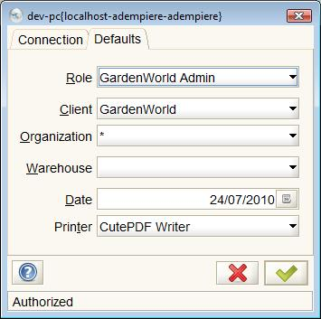
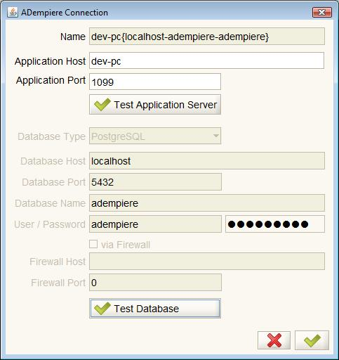
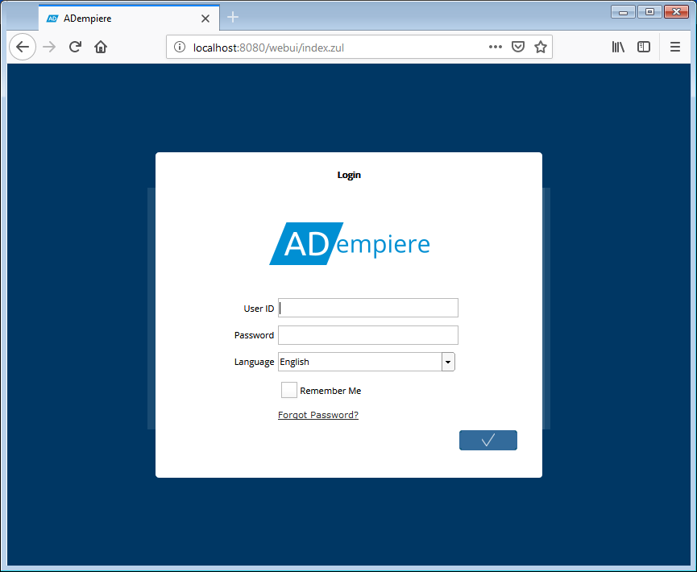
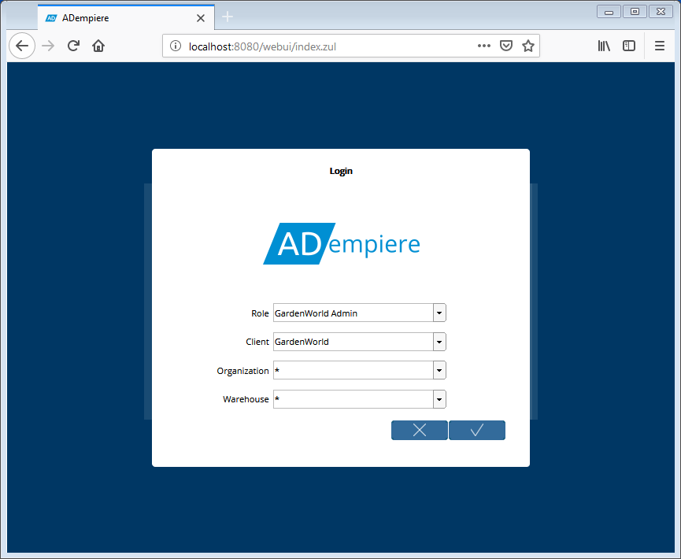

# Logging In

The Log In process is similar to both the Java Client and the Web Application. Each is discussed below. The default users and passwords are the same.

### **Default Users and Passwords**

The following Users and passwords are part of the initial seed database:

| For ... | **Log in as User ID...** | **With Password...** |
| :--- | :--- | :--- |
| System Management | System | System |
| System Management or any role/Client | SuperUser | System |
| Sample Client Administration | GardenAdmin | GardenAdmin |
| Sample Client User | GardenUser | GardenUser |

The System and SuperUser User accounts are used to manage the system. For first time use, try the GardenAdmin User account which will access the Garden World demonstration client.

For more information about using the Garden World Client when you first log on, see the page on [Garden World](http://wiki.adempiere.net/Garden_World) and its initial setup.

## Java Client

### The Login Dialog

After [Launching the ADempiere Application](launching-the-application.md) the login dialog will appear. This dialog has two tabs, a [Connection Tab](logging-in.md#connection-tab) and a [Default Tab](logging-in.md#defaults-tab). Before you can set the defaults, you must complete the connection by logging in. Enter you user name and password and click the green check mark \(  \) called "Confirm". If you don't have a user name, you can use one of the default names as shown below. For the first time, just confirm the defaults that appear and move on to [Finding Your Way Around](finding-your-way-around/).


The icons  and  at the bottom of each page will confirm/process or cancel the dialog respectively.


### Connection Tab

| **Field** | **Description** |
| :--- | :--- |
| Server | This field is for reference. You can change the definition of the server if you click in the field. This will bring the [**Connection Test Dialog**](logging-in.md#connection-test) up |
| User ID | Fill in with the user ID provided for you. There are a few defaults mentioned above. |
| Password | Fill in with the password provided for you. Again, the defaults are above. |
| Language | Select the language you wish to use. The change is immediate. |


Note that it is not possible to request a new password when using the Java Client application. If you forgot your password, please contact an Administrator for your Client to have it reset.


The first field called Server shows which server and database you are connected to. The Server field highlights the status of the application server and database that will be used. It indicates this status with a red background if either:

* the database service is not available or the connection information is incorrect or the connection hasn't been initiated; and
* the application server is not running of the connection information is incorrect.

If only one of the the application server or database service is the cause of the problem, the icons on the right and left of the field will appear red. For example, in the image above, the database icon is red indicating, in this case, that the database connection hasn't been attempted yet. If both the application server and database connection have issues, the entire field will be red.

When launching the client, the initiation process tests the application server status but not the database connection. The Server field will show the database with a red background as in the diagram above. This is normal. Once you enter the user name and password, the connection is established. The delay in the database connection allows you to change the database during the log-in process.

Click in the Server field to go to the Connection Test Dialog to diagnose the problem causing red backgrounds in the field or to change the database parameters.


The Client will still operate if the database is available but the application server is not running.


### Defaults Tab

After selecting the desired values in this tab, you can click on the green check mark to start the application. See [Finding Your Way Around the Client](finding-your-way-around/).

| **Field** | **Description** |
| :--- | :--- |
| Role | Select the role to work on ADempiere. The list is filled with the roles allowed for the user |
| Client | Select the client/company to work on ADempiere. The list is filled with the companies allowed for the role |
| Organization | Select the default organization to work on ADempiere. The list is filled with the organizations allowed for the role and user |
| Warehouse | Select the default warehouse to use for this session |
| Date | Fill in the default date to keep while working on ADempiere |
| Printer | Select the default printer to work on ADempiere |

### Connection Test Dialog

When you click in the Server field in the Connection tab of the login dialog, the Connection Test dialog appears. Note that this window is intended for system administrators. As a user, you should not need to look at it.


Please talk with your system administrator if you don't know how to manage this window. In order to use the Connection Test Dialog, the ADempiere Application Server must be running and the database service must be available.


| **Field** | **Description** |
| :--- | :--- |
| Name | The name of the connection is generated automatically by Adempiere |
| Application Host | Fill in with the hostname or IP address of the JBoss Adempiere server |
| Application Port | Fill in with the port for the JBoss Adempiere server, normally 1099 |
| Connection | Select the connection type from the list, provided are LAN, Terminal Server, VPN and WAN. Normally LAN can work for you. |
| Overwrite | Check here if you need to overwrite the database definition provided by the JBoss Adempiere server |
| Test Application Server | Click this button to test the JBoss Adempiere server and get the database information from there |
| Database Type | Select the database type, provided are Oracle, DB2, PostgreSQL, Fyracle |
| Database Host | Fill in with the hostname or IP address of the database server |
| Database Port | Fill in with the port provided to connect to database |
| Database Name | Fill in with the database name \(instance for Oracle\) |
| User | Fill in with the database user owner of Adempiere schema |
| Password | Fill in with the database password |
| via Firewall | Check here if you need to connect via Firewall \(only for Oracle connection\) |
| Firewall Host | Fill in with the hostname or IP address provided for the firewall |
| Firewall Port | Fill in with the port provided for the firewall |
| Test Database | Click this button to check the database connection |

Once all the tests are complete, click the green check mark to return to the Defaults Tab.

## WEB Application

The Web Application launch is simpler than the JAVA Client as there is no need to verify the connection with the server. After Launching the Web Application you will be presented with a login dialog as shown below.

The login fields are pretty self-explanatory:

| **Field** | **Description** |
| :--- | :--- |
| User ID | Fill in with the user ID provided for you. There are a few defaults mentioned above. |
| Password | Fill in with the password provided for you. Again, the defaults are above. |
| Language | Select the language you wish to use. The change is immediate. |
| Remember Me | Check if you wish the Login Dialog to remember your entries the next time you access the Web Application.  This option will only appear if allowed in your implementation. |
| Forgot Password? | Click this link if you have forgotten your password.  A dialog will be presented where you can enter your User ID and submit the request to have the password reset.  You will receive an email with a link to a page where you can reset your password.  The email link will be active for only 5 minutes. |

After you click the Confirm button, the dialog will change to allow the selection of the Role, Client, Organization and Warehouse.

The Roles available to the User will determine the Client and possibly the Organization and Warehouse. The first time the user logs in, the _**Default**_ Role \(as defined in the **User Assignment** tab of the **Role** window or **User Roles** tab of the **User** window\) will be selected. From then on, the Role selected on the last login will be the default.


If there is only one Role available to the User and the System is configured to only show multiple roles, the Role combo box may not be displayed in the dialog.


After selecting the Role, Client, Organization and Warehouse, click the Confirm button to complete the login. See [Finding Your Way Around the Web App](finding-your-way-around-the-web-app/).

