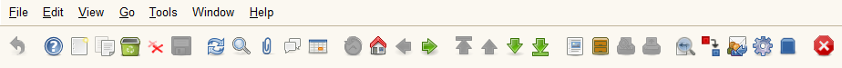
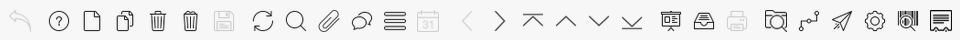
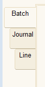
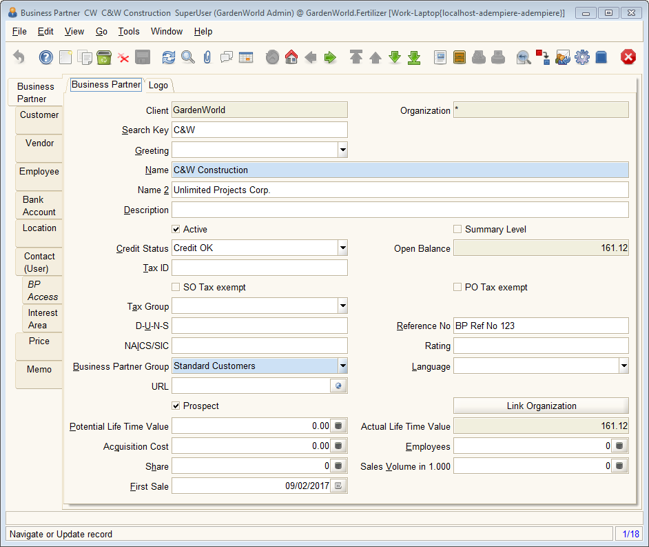
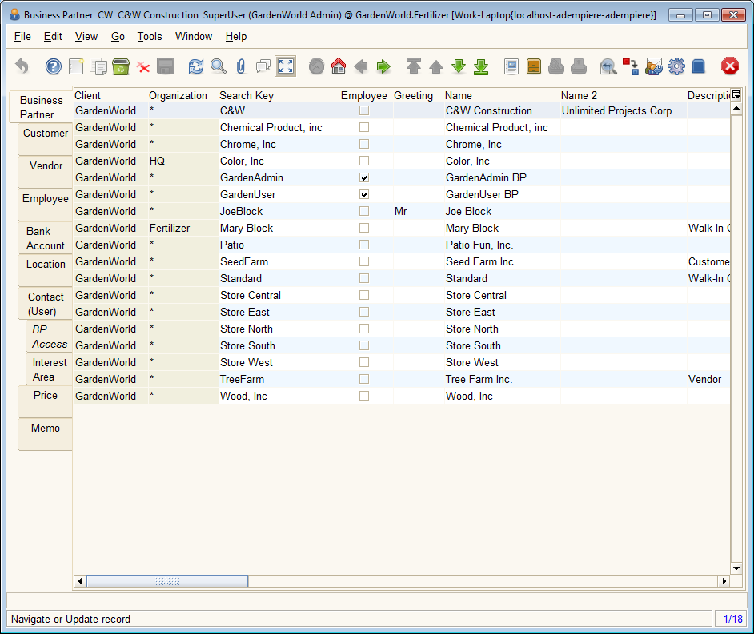

# Opening and Using Windows

In the ADempiere Menu Tree, clicking on or activating any item that has the Window icon \(  \) will open a window that will display data in a table.

Most windows are organized the same way in ADempiere, and, apart from the style differences, function the same way in the Java Client and the Web App. Images used in this manual to highlight certain windows may come from either. While the look may differ, the location and function of most icons and fields will be the same.

At the top of the window is a Tool Bar of icons that are common across all Windows as shown below. See [The Tool Bar](the-tool-bar.md) for more information about the icons and functions the represent.

In the Java Client, a window will show a form with tabs on the left. The Web App can display the tabs on either side. The tabs represent sets of hierarchical data: parent and child records if you will. Each subordinate tab will show records related to the record currently selected/viewed in the parent tab.

In the image above, the GL Journal Batch window has three levels of tabs. Each Batch record could have several Journal records and each Journal record could have several lines. To look at a Line record, you would first have to select the Batch and then a Journal.

Moving between records and switching between tabs allows you to go through huge amounts of data without having to backtrack as much. When you move between records or tabs, whatever data you have entered is automatically saved.

In each tab, the data can be displayed as a table view \(like a spreadsheet\) where you can see many records at once or as a form view showing one record at a time. Buttons that control processes will generally be accessed from the form view.

At the bottom of the window is a status bar providing information about the available actions or results of a process. At the very bottom right is a record count showing the current record number and the total number of records displayed. If you click on this record count a [Record Info dialog](../dialogs-and-forms/change-log-or-record-info.md) \(also called a Change Log\) will be displayed.

