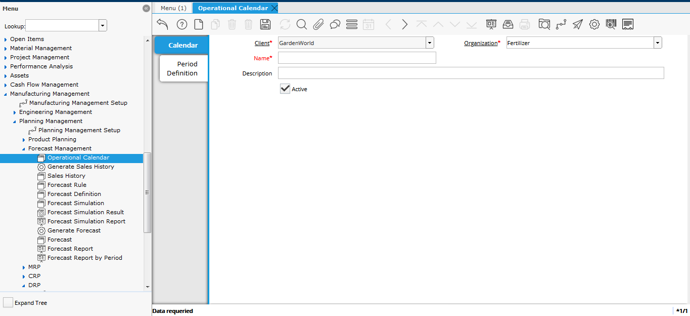
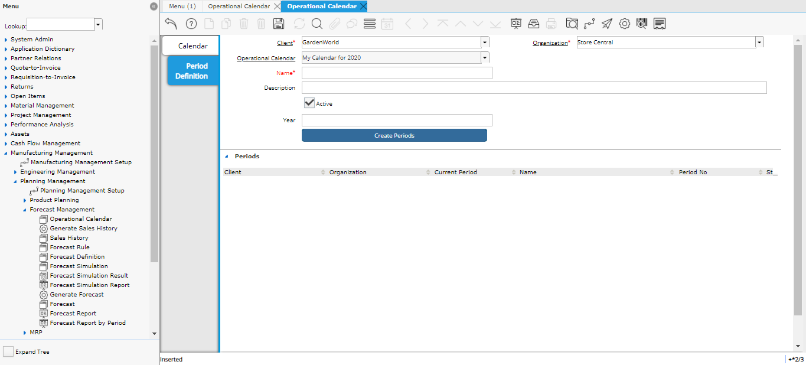
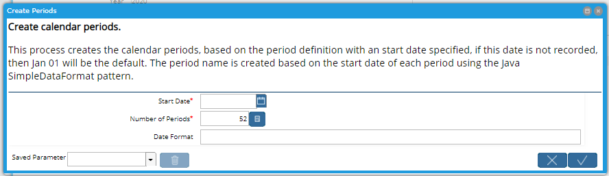
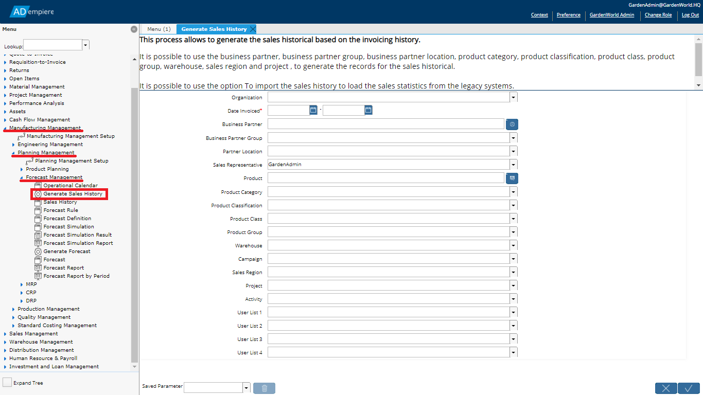

# Forecasting

## Overview

Forecasting is a way to estimate the future quantity and revenue from sales of products or services over a period of time.  Forecasts use quantitative and statistical methods based on historical data and market statistics to predict future sales.

The projected quantities and sales amounts can be used for decision making, pricing, cash flow, estimated future demand, calculating master production schedule, supply plan and future capacity requirements.

A forecast is basically a set of products, quantities and time that shows how much of a particular product will be required or sold at that time.  The forecast data is used by the Material Resource Planning to drive the material planning processes which will trigger purchase demands for raw material and production activity to generate the required products in time to meet the forecast.

Forecasts have several basic components that are discussed in detail below:

1. An **Operational Calendar** which defines the number and duration of the periods that will be used for the forecast.  The periods are forecast buckets or measurement cycles which can be, for example, weekly or monthly periods.
2. The **sales history** on which the forecast is based.
3. A set of **Forecast Rules** which are the various mathematical and statistical processes that can be applied.  Additional rules can be added in software if required.
4. A **Forecast Definition** which defines the parameters required by the Forecast Rules and filters on the historical data.
5. **Simulations** of the forecast which use all the above to calculate forecast amounts.
6. The **accepted forecast** which is generated from the simulations and which can be used in Material Resource Planning to generate demands on the production system.

## Operational Calendar

The operation calendars defined the set of periods that will be used in the forecast calculations and reports.  These periods are like buckets or measurement cycles with a specific duration.    

For planning purposes, the choice of period size depends on your manufacturing and sales turnover time.  Typically, the periods will be weekly or monthly.  Too small periods can result in excessive data that is difficult to deal with.  Periods that are too large can generate manufacturing plans that are not efficient resulting in excessive inventory.  You can create multiple calendars to test which approach works best for your situation.

To define the Operational Calendar open the **Operational Calendar** window in the **Manufacturing Management -&gt; Planning Management -&gt; Forecast Management** menu. 

Create a new record and give it a name and description. Save the record and move to the **Period Definition** tab.

### Period Definition

The **Period Definition** tab, provides a way to create periods to use in the Forecast.  

The main fields here are:

| Field | Description |
| :--- | :--- |
| _**Name**_ | A name for the period definition record.  As you may have several period definitions for a single calendar, the name is used to identify them. |
| _**Description**_ | A description of the period definition if required and helpful. |
| _**Year**_ | The Calendar Year that the periods will start in.  This only applies if a _**Start Date**_ is not set in the **Create Periods** process discussed below.  If a _**Start Date**_ is specified, the "year" used will be the year of that date instead of this field. |


At the time of writing, the _**Start Date**_ parameter is mandatory, making the _**Year**_  field irrelevant. See issue [\#3013](https://github.com/adempiere/adempiere/issues/3013).


#### Creating the Periods

With the Period Definition record completed, the periods are created by clicking the button _**Create Periods**_ below the _**Year**_  field in the **Period Definition** tab.  

The parameters for the process are as follows:

| Parameter | Description |
| :--- | :--- |
| _**Start Date**_ | The start date for the periods. |
| _**Number of Periods**_ | 12 or 52 are allowed, providing monthly or weekly periods. |
| _**Date Format**_ | The period name will follow the date format entered here.  This uses the Java [SimpleDateFormat](https://docs.oracle.com/javase/9/docs/api/java/text/SimpleDateFormat.html) pattern.   |

The Periods begin on the start date specified.  The format pattern should be enough to differentiate the period.  For example, a common format for months would be "yyyy-MM" which would create periods that can be sorted in chronological order by year and month.  For weeks, you might use "yyyy-MM-DD' \('w'\)'" which would give the start date of each week period and the week number in brackets.


If you run the Create Periods process multiple times, it will create multiple versions of the periods.  While you can use this to generate periods over multiple years, you can also duplicate periods within the year if you are not careful.  If you do need to redo the Create Periods process, please delete the existing periods first. See issue [\#3014](https://github.com/adempiere/adempiere/issues/3014).


### Periods

The periods created by the process are listed in the **Periods** tab which is embedded in the **Period Definition** tab.  Each period has a name, period number, start date and end date, which set the date range for the specified period.  You can manually manipulate the periods if required.

## Sales History

The forecasts are created by extrapolating a historical trend.  This trend is defined either by the sales contained in historical invoices or directly from an import of data.  The sales history provides the statistical data required to generate a forecast.

### Generating Sales History from Invoices

Not every invoice is relevant when it comes to forecasting so the process of creating the history is selective and only copies relevant information from the invoices into the sales history.

The filters used to select the relevant invoices include: 

* business partner; 
* business partner group;
* business partner location;
* product category;
* product classification;
* product class;
* product group;
* Product
* warehouse;
* sales region;
* project; and more

To generate the sales history, run the **Generate Sales History** process found  in the **Manufacturing Management -&gt; Planning Management -&gt; Forecast Management** menu.

As you can see in the image, there are a large number of parameters. Only the _**Date Invoiced**_ range is mandatory. 

### Importing Sales History

When ADempiere does not hold enough data to provide its own sales history, there is the possibility of importing data from other sources, such as a legacy system.  The import is performed using the standard [Data Import](../system-administration/data/data-import.md) processes.  The import can be used to provide the sales statistics necessary to perform the forecast.

There is an **Import Sales History** import format that can be used or modified to suit your needs.  At a minimum, the sales history needs to know the qty invoiced, the invoiced date, the warehouse that the products were shipped from and the business partner who was invoiced.  The sales history can provide much richer data than that though including business partner data, prices, costs and reference values.

The historical sales information is used to realize the forecast calculus and to get sales statistics reports.

## Forecasting Rules

The Forecasting Rules define the mathematical and statistical methods that are available to calculate the forecast given a set of Sales History data.  These rules are used in the Forecast Definition to define how the forecast will be calculated. There are nine rules provided in the core application but it is possible to extend these with others by providing the appropriate software classes.  The rules are described in detail in [Engineering Statistics Handbook, 6.4 Introduction to Time Series Analysis](https://www.itl.nist.gov/div898/handbook/pmc/section4/pmc4.htm) by Author Steven R. Gould.  The summaries below are taken from this reference.

In the **Forecast Definition** window, the Simulation parameters can be entered.  How these parameters apply to the Rules depends on the rule.  A summary of which rule uses which parameters is shown in the table below.

| Rule ... | Uses Parameter ... | To ... |
| :--- | :--- | :--- |
| Moving Average | _**User Factor**_ |  _****_Define the number of periods to average.  F |
| Single Exponential Smoothing | _**Factor Alpha**_ | Define the smoothing constant. This is a value from 0 to 1. The higher the number, the faster the dampening or weight given to data. |
| Double Exponential Smoothing | _**Factor Alpha**_ | Define the smoothing constant. This is a value from 0 to 1. The higher the number, the faster the dampening or weight given to data. |
|  | _**Factor Gamma**_ | Define the trend smoothing constant. This is a value from 0 to 1. The higher the number, the faster the dampening or weight given to data. |

### Moving Average

| Uses Parameter ... | To ... |
| :--- | :--- |
| _**User Factor**_ | Define the number of periods to average.  For example, if the sales history data is using weeks and a 10-week moving average is required, set the _**User Factor**_ to 10.  This also determines the maximum number of periods that can be forecast into the future. |

A moving average forecast model is based on an artificially constructed time series in which the value for a given time period is replaced by the mean of that value and the values for some number of preceding and succeeding time periods. As you may have guessed from the description, this model is best suited to time-series data; i.e. data that changes over time.  For example, many charts of individual stocks on the stock market show 20, 50, 100 or 200 day moving averages as a way to show trends.

 Since the forecast value for any given period is an average of the previous periods, then the forecast will always appear to "lag" behind either increases or decreases in the observed \(dependent\) values.  For example, if a data series has a noticeable upward trend then a moving average forecast will generally provide an underestimate of the values of the dependent variable.

 The moving average method has an advantage over other forecasting models in that it does smooth out peaks and troughs \(or valleys\) in a set of observations. However, it also has several disadvantages.  In particular this model does not produce an actual equation. Therefore, it is not all that useful as a medium-long range forecasting tool. It can only reliably be used to forecast one or two periods into the future.

 The moving average model is a special case of the more general weighted moving average. In the simple moving average, all weights are equal. __

### Simple Exponential Smoothing

| Uses Parameter ... | To ... |
| :--- | :--- |
| _**Factor Alpha**_ | Define the smoothing constant. This is a value from 0.0 to 1.0. The higher the number, the faster the dampening or weight given to recent data. |

Simple \(or single\) exponential smoothing is a very popular model used to produce a smoothed time series. Whereas in simple Moving Average models the past observations are weighted equally, Exponential Smoothing assigns exponentially decreasing weights as the observations get older.

In other words, recent observations are given relatively more weight in forecasting than the older observations.

In the case of moving averages, the weights assigned to the observations are the same and are equal to 1/N. In simple exponential smoothing, however, a "smoothing parameter" - or "smoothing constant" - is used to determine the weights assigned to the observations.

This simple exponential smoothing model begins by setting the forecast for the second period equal to the observation of the first period. Note that there are ways of initializing the model. As of the time of writing, these alternatives are not available in this implementation. Future implementations of this model may offer these options.

#### Choosing a Smoothing Constant

The Single Exponential Smoothing rule uses the _**Factor Alpha**_ as the Smoothing Constant.

The smoothing constant must be a value in the range 0.0-1.0. But, what is the "best" value to use for the smoothing constant? This depends on the data series being modeled. The speed at which the older responses are dampened \(smoothed\) is a function of the value of the smoothing constant. When this smoothing constant is close to 1.0, dampening is quick - more weight is given to recent observations - and when it is close to 0.0, dampening is slow - and relatively less weight is given to recent observations.

The best value for the smoothing constant is the one that results in the smallest mean of the squared errors \(or other similar accuracy indicator\).  There are numerical methods for determining this value but these would have to be applied outside of ADempiere.

### Double Exponential Smoothing

| Uses Parameter ... | To ... |
| :--- | :--- |
| _**Factor Alpha**_ | Define the smoothing constant. This is a value from 0.0 to 1.0. The higher the number, the faster the dampening or weight given to data. |
| _**Factor Gamma**_ | Define the trend smoothing constant. This is a value from 0.0 to 1.0. The higher the number, the faster the dampening or weight given to data. |

Double exponential smoothing - also known as Holt exponential smoothing - is a refinement of the popular single exponential smoothing model but adds another component which takes into account any trend in the data. Simple exponential smoothing models work best with data where there are no trend or seasonality components to the data. When the data exhibits either an increasing or decreasing trend over time, simple exponential smoothing forecasts tend to lag behind observations. Double exponential smoothing is designed to address this type of data series by taking into account any trend in the data.

Note that double exponential smoothing still does not address seasonality. For better exponentially smoothed forecasts using data where there is expected or known to be seasonal variation in the data, use triple exponential smoothing.

As with simple exponential smoothing, in double exponential smoothing models past observations are given exponentially smaller weights as the observations get older. In other words, recent observations are given relatively more weight in forecasting than the older observations. 

Double Exponential Smoothing uses _**Factor Alpha**_ ****and _**Factor Gamma**_ as the smoothing factors.  Factor Alpha smooths the base data and Factor Gamma smooths the trend.

### Triple Exponential Smoothing

| Uses Parameter ... | To ... |
| :--- | :--- |
| _**Factor Alpha**_ | Specify the tolerance of the alpha \(base data\) smoothing factor.  The smoothing factor is a number from 0.0 to 1.0 so the tolerance would need to be a much smaller number.  The smaller the number, the more calculations may be required to find the best fit. |
| _**Factor Beta**_ | Specify the tolerance of the beta \(trend data\) smoothing factor.  The smoothing factor is a number from 0.0 to 1.0 so the tolerance would need to be a much smaller number.  The smaller the number, the more calculations may be required to find the best fit. |

Triple exponential smoothing - also known as the Winters method - is a refinement of the popular double exponential smoothing model but adds another component which takes into account any seasonality - or periodicity in the data.

Simple exponential smoothing models work best with data where there are no trend or seasonality components to the data. When the data exhibits either an increasing or decreasing trend over time, simple exponential smoothing forecasts tend to lag behind observations. Double exponential smoothing is designed to address this type of data series by taking into account any trend in the data. However, neither of these exponential smoothing models address any seasonality in the data.

For better exponentially smoothed forecasts of data where there is expected or known to be seasonal variation in the data, use triple exponential smoothing.

As with simple exponential smoothing, in triple exponential smoothing models past observations are given exponentially smaller weights as the observations get older. In other words, recent observations are given relatively more weight in forecasting than the older observations.  

At least two complete cycles \(years\) of data are required to initialize the model. For best results, more data is recommended - ideally a minimum of 4 or 5 complete cycles. This gives the model a chance to better adapt to the data, instead of relying on getting - guessing - good estimates for the initial conditions.

The parameters for the triple exponential smoothing algorithm are determined using a best-fit Mean Square Error \(MSE\) approach.  As a result, only the tolerances for the alpha and beta smoothing parameters are required.

### Polynomial Regression


The implementation of the Polynomial Regression algorithm does not take any parameters.


This rule implements a single variable polynomial regression model using the variable named in the constructor as the independent variable. The coefficients of the regression as well as the accuracy indicators are determined from the data set used in the initialization.  

A single variable polynomial regression model essentially attempts to put a polynomial line - a curve if you prefer - through the data points. Mathematically, assuming the independent variable is x and the dependent variable is y, then this line can be represented as:

$$
y = a0 + a1*x + a2*x^2 + a3*x^3 + ... + am*x^m
$$

The default for the order $$m$$ is 10  but the order is reduced to the square root of the number of data points if there are less than 100 data points.

### Regression


The implementation of the Regression algorithm does not take any parameters.


This model implements a single variable linear regression. The coefficients of the regression - the intercept and the slope - as well as the accuracy indicators are determined from the sales history and are applied to the forecast.

A single variable linear regression model essentially attempts to put a straight line through the data points. For the more mathematically inclined, this line is defined by its gradient or slope, and the point at which it intercepts the x-axis \(i.e. where the independent variable has, perhaps only theoretically, a value of zero\). Mathematically, assuming the independent variable is x and the dependent variable is y, then this line can be represented as:  

$$
y = intercept + slope * x
$$

### Multiple Linear Regression


The implementation of the Multiple Linear Regression algorithm does not take any parameters.


This model implements multiple variable linear regression but with only one independent variable, time.  So in effect, it is no different than the Linear Regression model.

It might be interesting to use this model to forecast demand given time and say price but the current implementation will not allow that.

### Naive Forecasting


The implementation of the Naive Forecasting does not take any parameters.


A naive forecasting model is a special case of the moving average forecasting model where the number of periods used for smoothing is 1. Therefore, the forecast for a period, t, is simply the observed value for the previous period, t-1.

Due to the simplistic nature of the naive forecasting model, it can only be used to forecast up to one period in the future. It is not at all useful as a medium-long range forecasting tool.

This really is a simplistic model, and is included partly for completeness and partly because of its simplicity. It is unlikely that you'll want to use this model directly. Instead, consider using either the moving average model, or the more general weighted moving average model with a higher \(i.e. greater than 1\) number of periods, and possibly a different set of weights.

#### Forecast Engine.

The forecasting engine has the function to expose the implementations for each forecast rule, the interface ForecastRule.java is the interface to implement each forecast rule.

The developers can use this interface to implement their own calculation algorithms.

### Forecast definition:

This window allows to define the valid combinations, used to select the historic sales records. The combinations order is determined by the sequence, where the lower sequence has priority over the higher sequence.

The information to define combinations are defined by business partner data \(business partner, business partner group, sales region and campaign\), Product data \(product, category, classification, class and group\), factor data for calculus \(Alpha Factor, Gamma, Multiplier, Scale\).

The suitable use of the forecast definition, allows to generate calculus with different factors for each main group of data defined for a business partner or product.

In this way is possible to get a forecast for each product category, different from another.

To set the sequence of the combinations is possible to use the tab of sequences, with which is possible to define the order of each combination.

### Forecast simulation:

The forecast simulation window, allows to define the required parameters to process a forecast calculation, these parameters are used for the forecast engine to extract the data from the sales historical, to execute the calculation algorithm based on the forecast rule and to save the forecast results.

Forecast Definition: Establishes the forecast definition for this simulation.

Forecast Rule: Establishes the forecast rule to calculate this simulation.

Operational Calendar: Establishes the calendar to use, for the base periods definition and the target period definition.

Source Warehouse: Determines the warehouse for which the sales statistics information will be filtered, in this way it is possible to calculate a forecast for an specific warehouse.

Base Period Definition: Defines the basic periods to filter the sales history information.

Target Periods Definition: Defines the target periods, once the simulation process is executed the calculated values are organized in the order of the target periods definition.

Periods Historical: Determines the number of history periods, which must be used for the forecast calculation, the periods number are equivalent to the defined inputs at the operational calendar.

Target Warehouse: Determines the destiny warehouse with which the results are generated. In some enterprises the sales historical is generated for each point of sales, by this field is possible to change the source warehouse to a target warehouse with the goal of consolidate the demand in a target warehouse.

Calculate Forecast: This process allows to execute, by the forecast engine, the calculus algorithm established by the forecast rule, the forecast engine uses the established factors in the forecast definition. The calculated values for each period are saved as result of the simulation.

#### Master of Forecast Simulation:

The records of this tab are generated as result of applying the combinations set in the forecast definition, each master record is a unique combination of product, warehouse, and the forecast factors used for this calculus.

Alpha Factor: This factor is used for the forecast engine and determines the smoothing constant used for some forecast models of exponential smoothing. It hast to be a value in the range of 0.0-1.0

Gamma Factor: This factor is used for the forecast engine and determines the smoothing constant used in second place for some forecast models of exponential smoothing forecast, the Gamma Factor is used to smooth the tendency, it must be a value in the range of 0.0-1.0

Multiplied Factor: This factor is used by the forecast engine and determines the percentage in which the calculated quantity of the forecast is increased or decreased. A negative percentage indicates the quantity is reduced.

Scalar Factor: This factor is used for the forecast engine and determines the percentage to be multiplied or scale a calculated quantity of the forecast, this value must be absolute.

#### Forecast Simulation Detail:

The records of this tab are generated as result of applying the established combinations in the forecast definitions and the number of established periods in the definition of basic periods for each master of forecast simulation, a detail record is created for each period accumulating the invoiced quantities between the range of the start and the period end date.

#### Forecast simulation line:

Shows the source of the sales historical for each detail.

#### Results of the Forecast Simulation:

The records on this tab are generated by the execution of the Forecast Engine, using the implemented algorithm in the Forecast Rule, a record is created for each established period in the target periods definition.

The Forecast Engine uses the Forecast Simulation Detail, the Forecast Rule and the factors, to calculate a resultant forecast for each target period, this allows to use the sales historical of the previous year and to calculate the current year sales forecast.

### Forecast Simulation Result:

The forecast simulation browser allows to compare base period data with the simulation result of the target period, after executing a forecast simulation. The goal of this query is to validate that the results are considered in the company plans.

### Forecast Simulation Report:

This process generates a report containing the result of the forecast calculation, parameters can be used to filter the result of the report. The main goal of this report is to evaluate and analyze the result of multiple simulations to determine the most adequate, to be able to generate the forecast.

### Generate Forecast Process:

This process allows to generate a forecast based on the forecast simulation calculation.

The process uses the resulting simulation values ​ to generate a new forecast.

Action Type of the forecast:  It Indicates how the forecast will be generated

If the action type is "Replace" all lines of this forecast are going to be  eliminated and will be generated again, based on the simulation products and the selection criteria.

If the action type  is "Merge" all lines of this forecast will be combined, based on the unique combination of product, warehouse and period. Therefore, if the combination exists, the forecast quantities are accumulated.

The Load Type of forecast: Indicates which date of the period will be used to determine the forecast line promised date.

Options:

To Use the Period Start Date: The due date is set  based on the period start date

To Use the Period End Date:  The due date is set based on the period end date.

Days after the due date:  Indicates the number of days to be added or subtracted to the due date. If the value is negative, the days are subtracted.

#### Selection Criteria:

It is possible to use the category, classification, class and group of the product to get the products to be included in the new forecast.

### Forecast:

The Forecast window allows to maintain the sales forecast information for an organization.

Inside the forecast window the field  Price List has to be defined to determine the sales goal amounts and to obtain an estimated value for the sales plan by sales representative.

The Forecast report show the Sales Plan , the goal amounts which has to be accomplished, the information to be grouped by sales representative, product, warehouse and period.

The field Operational Calendar and Periods Definition, must be defined to determine the delivery promised date for the forecast products.

The forecast lines can be captured manually entering the sales representative, product, warehouse, quantity, period or it can be generated from a simulation using the Generate forecast process.

The products and its quantities are considered by MRP when  the forecast is already  processed, ADempiere allows to have several forecast simultaneously.

If you don’t want that MRP considers a Forecast processed,  it should be deactivated.

### Forecast Report:

This process generates a sales forecast detailed report, classified by sales representative, product warehouse, period and promised date, these parameters can be used to create filters at the report result.

The main goal of this report is to analyze the sales plan, considering quantities and amounts.

### Forecast Report by Period:

This process generates a report summarized by forecast period , some parameters can be used to filtrate the report results.

The main goal of this report is to analyze the sales plan, considering quantities and amounts by an specific period.

