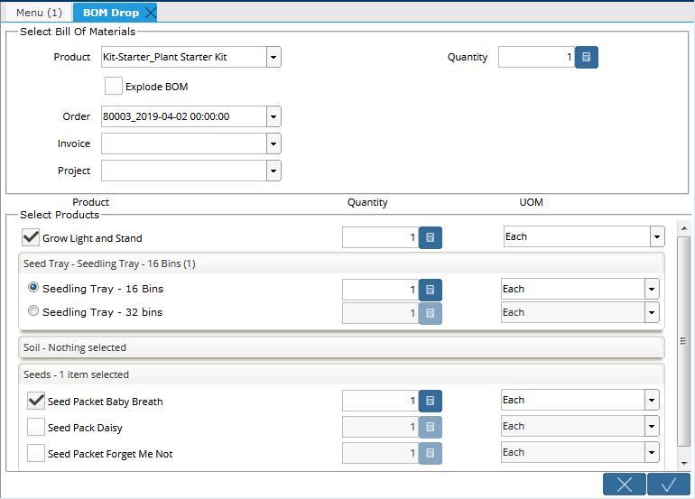

# BOM Drop

Adding the components of a BOM to a document is referred to as "Dropping" the BOM onto the document. This can be performed in two ways:

1. Ensure the parent product is not Stocked. When the parent product is added to an Order, it will be replaced by its components. See the note in the description of the Stocked field in [Basic Product Setup](product-setup/defining-the-product/basic-product-setup.md#stocked);
2. Use the **BOM Drop** form which can be used to drop any default BOM onto an Order, Invoice or Project.

## BOM Drop Form

The **BOM Drop** form provides more control over which components of the BOM are added to the document and the quantities of each. Used with Optional or Variant components, the form acts as a checklist or menu of components, allowing the user to quickly select which options or variants are added to the document. This is especially helpful where product configuration is common. For example, when buying components to build a computer.

The form is accessed from the **Material Management** menu or from a button/process on an Order, Invoice or Project.

### Selecting the BOM to Drop

At the top of the form is a selection panel where the parent product can be selected. The panel will show the following fields:

| Field | Description |
| :--- | :--- |
| _**Product**_ | The parent product.  The Product must have a default BOM and be Verified. |
| _**Quantity**_ | Select an integer quantity of the product to add to the document. The quantities of the BOM components will be adjusted accordingly. |
| _**Explode BOM**_ | Explode or expand the BOM to include all sub-components, if any. |
| _**Order**_ | Select the target Order document.  The documents must be in a draft or "In Progress" state.  This field only appears if the form is opened from the menu. |
| _**Invoice**_ | Select the target Invoice document.  The documents must be in a draft or "In Progress" state.  This field only appears if the form is opened from the menu. |
| _**Project**_ | Select the target Project.  This field only appears if the form is opened from the menu. |


Only one target document can be selected at a time.


### Selecting BOM Components

When a Product is selected, the lower panel will show the components of the default BOM for that product. Only [Component Types](product-setup/defining-the-product/product-bill-of-materials/bom-components.md#component-type) **Component**, **Option,** or **Variant** will be shown. However, if the _**Explode BOM**_ checkbox is selected, any component type that represents a BOM will be exploded to the lowest level. For example, a [Phantom](product-setup/defining-the-product/product-bill-of-materials/bom-components.md#component-type) component type will not appear in the lower panel but its sub-components will if the top level BOM is exploded.

The lower selection panel is a list of the BOM sub-components. **Option** and **Variant** component types will be grouped by the [Feature](product-setup/defining-the-product/product-bill-of-materials/bom-components.md#feature) to which they belong. There will be one group for each feature name, Component Type and parent product - even if the feature names are the same.

The fields are as follows:

| Field | Description |
| :--- | :--- |
| **Product** | A check box or radio button selection of the BOM line product. **Component** component types will be selected by default and can't be deselected. They are considered mandatory. Within a feature, only one **Variant** component type can be selected at a time and one must be selected.  The first Variant is selected by default.  **Option** component types are deselected by default and one or more of these components can be selected at a time. |
| **Quantity** | The BOM Line quantity that will be used on the document.  Initially, it is the BOM Line quantity multiplied by the BOM quantity in the upper panel.  It can be adjusted. |
| **UOM** | The Unit of Measure to use on the document line.  Where conversions exist for the selected component product, the UOM can be changed as required. |


As the Price List is in the Product's UOM, the quantity and UOM used in the form will be converted to the Product UOM on an Order or Invoice.


At the bottom of the form are standard Cancel and Confirm buttons. The Confirm button will be enabled when a Product BOM is selected and, if opened from the Menu, a target document is selected. Clicking Confirm will save the selected components to the document as new lines. Clicking Cancel or closing the form will cancel the BOM Drop.

## Restrictions

### Products must have a Default BOM and be Verified

To appear in the BOM selection panel, the product must have a [Default BOM](product-setup/defining-the-product/product-bill-of-materials/#default-bom) and be [Verified](product-setup/defining-the-product/basic-product-setup.md#bill-of-materials-verify-bom-verified).

### Components Must Exist on the Price List

To drop components into an Order or Invoice, the component products must exist on the price list being used on the document. If not, an error will be displayed. This does not apply to Projects.

### Target Documents must be Draft or In-Progress

Only Draft or In-Progress Orders and Invoices can be target documents. This does not apply to Projects.

