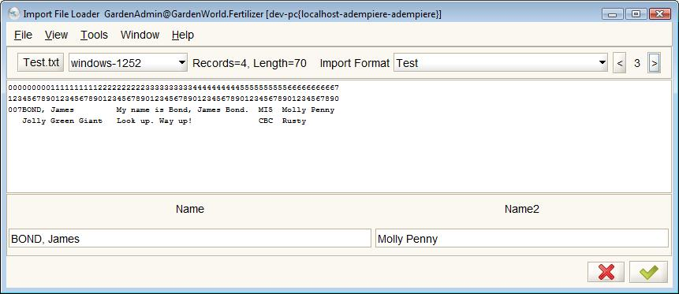

# Data Import

## Introduction

The Data Import features of ADempiere allow you to import data into the database as part of the process of establishing opening balances, entering historical data or for routine entry of orders, invoices and general journal entries. Importing of bank statements is covered in the [Banking](http://wiki.adempiere.net/Banking) page.

The data import process has two main steps. Data is read into the system and placed in a temporary table. From there it is processed and entered into the main database. The two step process helps prevent errors in the data from affecting the main database. The first step of importing the data requires a definition of the data file that will be imported and information about where to put it in the temporary tables. This is performed by an Import File Loader and an Import Loader Format.

## Import Loader Format

The **Import Loader Format** Window is simply a window that defines the target intermediate table and a list of the fields that are to imported. In the **Import Format** Tab, you define both the import table and the format of the data to be imported.

The following import tables are available as a default:

* Business Partner
* Product ASI
* Product BOM
* Product
* Product Planning
* Price List
* Workflow
* Account
* Budget
* Report Line Set
* Inventory
* Employee Data
* Inventory Move
* Order
* Invoice
* Confirmations
* Currency Rate
* GL Journal
* Sales History
* Financial Agreement
* Payment
* Payroll Movement
* Fixed Asset
* Bank Statement
* Attendance Record
* Employee Attribute

This is simply a list of all tables in the database with the prefix I\_. \(See the validation rule AD\_Table Import Tables.\) If, for example, the target table was C\_BPartner, the import table would be I\_BPartner. The relation with the target table is not one-to-one. The import tables are used to create subordinate information as well. The I\_Invoice table is used to create invoice headers and lines. The I\_GLJournal table is used to create journal batches, journal entries and the journal line items. While you can add tables simply, the processing required to import the data from the import table to the target table\(s\) is involved and the subject of other articles. See the section For Developers

The import formats supported for the data file you wish to import include:

* Comma Separated \(CSV\)
* Custom Separator Char
* Fixed Position and
* Tab Separated

### Creating an Import Loader Format

To create a new Import Loader Format based on your data, login to your client and browse to **System Admin » Data » Import Loader Format**. This will open the **Import Loader Format** Window. Create a new record, give it a name and description of your choice then pick the import Table and the format of your data file. Move to the **Format Field** Tab.


It is helpful to give the Import Loader Format a name similar to the import data file. A leading number in the name can help keep the order of imports straight. For example, the csv file is called "0 - Opening Trial Balance.csv" and the Import Loader Format name is set to "0 - Opening Trial Balance". This makes it easy to deal with lots of import files and their associated formats.


The Import Format Tab is where you connect the data you want to import to the columns in the import table. An example will help here.

Suppose you have a list of invoices to import. Your list is in a spreadsheet which contains all the necessary columns. The Search Key/Values used in the spreadsheet match those already in the ADempiere database for the Business Partners and Products. \(If they don't, you will have to use an intermediate table to translate the key values. More on that later.\) In this case, you can simply define a row in the Import Format tab for each column of data in the spreadsheet. Pay attention to the following:

| Field Name | Description |
| :--- | :--- |
| _**Start No**_ | The _**Start No**_ field is important since it determines where to look for the record data. For a CSV file, it is the column number, with the first \(left most\) column being 1. |
| _**Sequence**_ | The _**Sequence**_ field simply provides another way to order the records. It has no other purpose. It is helpful to use it to keep the rows in the Import Format tab in the same order as the columns in the spreadsheet. Use the Start No or multiply by ten. For example, if you have data in columns 1, 2, 4, 7, 8 and 9 that should be imported, set the sequence to 10, 20, 40, 70, 80, 90 respectively. |


If the _**Data Type**_ is "Date", be sure to indicate the format and watch for differences between systems, such as dd/mm/yy vs. mm/dd/yy.


As you create the Import Loader Format, it is helpful to create header rows in your spreadsheet that match the _**Start No**_ and _**Name**_ columns. Then, in the Import File Loader, when the csv file and the loader format are selected, the first two rows you see in the import loader form will be the spreadsheet headings and you can quickly compare those values with the form column headings. When columns contain an ID it is hard to know what ID it is so the column description can highlight errors. 

To get rid of this test data, you can then either:

* delete the two rows and resave the data file;
* add another sheet to the workbook that displays all the data from the first except for the header rows and then only save that sheet as a CSV file; or
* import the data as is and delete the first two rows in the Import table before you process it.

## Preparing the data for Import

In an ideal world, you want to perform the data import to the intermediate table without errors and then process the intermediate table, also without errors. Errors within ADempiere take more effort to fix than applying the same corrections to a spreadsheet. So, if at all possible, prepare the data in a spreadsheet before attempting the import.


If you have too much data to deal with or no control over the format, you may have to consider developing a customer import loader - a software process. 


To properly prepare the data, it is important to understand the import process and what the Import File Loader and the Import processes are looking for.


First, review the concepts of [Database Tables and Common Fields](../../getting-started/key-concepts.md#database-tables-and-common-fields).


### Understanding the Import Process

Assuming your data has been read properly by the Import File Loader and is now sitting in the Import Table, when you press the button to perform the import, the import processes generally follow this sequence:

* For each record in the import data table that has not previously been imported, the software assigns default values to the mandatory fields \(_**Client**_, _**Organization**_, _**Created**_, _**CreatedBy**_, _**IsActive**_, _**Updated**_, _**UpdatedBy**_\) and sets two other fields: _**Import Error Message**_ to blank \(""\) and _**Is Imported**_  to "N".
* The software then tests the import field values, looking for matches with the information required in the database.
* If supporting records don't exist, they may be created: for example, the business partner identified on an invoice may be created if it doesn't already exist.
* As the software progresses and at the end, it tests for errors. If one is found, a suitable error message is saved in the field _**Import Error Message**_.
* Where there are no errors, the necessary data records are created in the database and the Import record field _**Is Imported**_ is set to 'Y'.

### **IDs and Value Fields**

It is important to understand the differences between the _**Value/Search Key**_, _**Name**_ and _**ID**_ fields. The ID fields are usually hidden numerical keys that distinguish one record from another. Their value is controlled by the software and they are generally not available for searches. The Value fields, on the other hand, are visible, often updateable and frequently used as the unique key for searches.

For example, a Business Partner in the database may have a _**Name**_ "C&W Construction", a _**Value**_ "C&W" and a _**C\_BPartner\_ID**_ field = 117.

When you import a table directly, the ID field is assigned by the software and you can set the key value to what ever you want. It is pretty straight forward. However, if you want to link your import data to data that is already existing in the database, for example connecting an invoice to a business partner such as "C&W Construction", you have to import the Value field "C&W" or Name so the software can link that to the C\_BPartner\_ID field 117.

If you know them, it is possible to import the ID values for the \*\_ID columns in the import table, but only for records that already exist in the database. The loader software that determines if data needs to be added only tests the existence of records where the ID value is null. In other words, if you set the ID value, the Import Loader will assume a record with that ID exists and flag errors when it can't find it.

The same approach applies to many of the look-up or reference fields. The database may use hidden keys for these fields that need to be matched by name. To import matching data, you have to know the name, not the key.

In some cases, if related records are not already in the database, the import process will try to create them. For example, if unknown business partners are referenced in imported invoice data, the business partners will be added to the database using the available information from the invoice import.

### **Cross Linking Data**

Where the import data uses different data formats than the database, you may need to perform a data translation using intermediate tables that relate the keys in the external data to the keys in the database. An example is where the source system for the data uses entirely different keys, values and names to describe records than ADempiere. A translation table provides a mechanism to find the ADempiere Search Key based on the source name or key value. 

In another actual example, an ADempiere installation replaced a POS/AR system that was run in parallel with Quickbooks. Here the issues was that the POS system and Quickbooks used different customer formats entirely. Linking was performed based on the corporate memory of the book keeper. ADempiere was loaded with Business Partners from Quickbooks but the AR invoices and payments had to use translation tables to ensure the debits and credits were charged to the correct accounts. In addition the Quickbooks chart of accounts was different than the ADempiere chart of accounts so translation was also required when importing trial balances and journal entries.


In practical terms, the intermediate table could be another spreadsheet in your import data workbook where the final import data spreadsheet uses the VLookup\(\) function to find the ADempiere key based on the key values in the spreadsheet with the raw data.


### **Mandatory and Optional Fields**

For advice on which fields are mandatory or optional, see the help for the individual Import windows.  Mandatory fields have to be included in the imported data.  


If the mandatory fields have the same value in all the data rows, its a good idea to add these to your spreadsheet and not use a Constant Value in the Import Loader Format.  Then all the data for your import is coming from one place, your data file.


## Defining the Import Loader Format

As mentioned above, the Import Loader will accept comma separated \(CSV\), a custom separator character, fixed position or tab separated data.

### **Fixed Position**

Fixed position data is treated differently than the other three and the meaning of the _**Start No**_ changes from the column of data to the character count in the data. Also, when Fixed position data is used, each field requires an _**End No**_. To test the fixed position data import, create a text file \(txt\) with the following lines:

```text
0000000001111111111222222222233333333334444444444555555555566666666667
1234567890123456789012345678901234567890123456789012345678901234567890
007BOND, James         My name is Bond, James Bond.  MI5  Molly Penny 
   Jolly Green Giant   Look up. Way up!              CBC  Rusty        
```

and save the file in &lt;ADEMPIERE\_HOME&gt;\data\import. \(This is for convenience. You can save it anywhere.\) The first two lines are there only to help with the column numbering.

Next, create an Import File Format with the following fields:

* Import Format Tab
  * _**Name**_: Test
  * _**Table**_: I\_BPartner
  * _**Format**_: Fixed Position
* Format Field Tab
  * _**Seq**_: 10, _**Name**_: Name, _**Column**_: Name\_Name, _**Data Type**_: String, _**Start No**_: 4, _**End No**_: 23
  * _**Seq**_: 20, _**Name**_: Assistant, _Column_: Name2\_Name2, _**Data Type**_: String, _**Start No**_: 59, _**End No**_: 70

Then open the **System Admin -&gt; Data -&gt; Data Import** menu **Import File Loader** form. Click on the button _**Select file to load**_ and find the text file you created above.

Next, click on the button labeled _**Import Format**_ and select the Import File Format "Test" you created above.

Using the **&lt;** and **&gt;** buttons, move to the third line. You should see the _**name**_ and _**name2**_ fields filled as shown below:



### **Delimited Data**

Delimited data using CSV, tab or other customer separator character is interpreted in columns of data. 


The _**Start No**_ is the column number with the left most column being 1.  Any column with _**Start No**_ = 0 will be ignored.


Each data line is read sequentially to find the delimiters.  

If fields include the delimiter character, ensure they are surrounded by double quotes \("\).   Double quotes can be included in the data by using them twice \(""\). For example: a CSV line of "Artikel,bez","Artikel,""nr""",DEM,EUR results in four data fields:

* Artikel,bez
* Artikel,"nr"
* DEM
* EUR

#### **Comments**

Any field data enclosed in square brackets '\[' or '\]' will be interpreted as a comment and ignored. The data for that field will be set to a null string. Only the first and last characters are tested.

#### **Dates**

Date data is read as a string and converted to a timestamp without milliseconds \(YYYY-MM-DD HH24:MI:SS\). The Data Format field is used to set the format of the date data using the Java class SimpleDateFormat. See the link for the wide variety of format patterns available.


One confusing bit with the date formats has to do with months and minutes, one is 'M' and the other 'm'. A data format like 'dd/mm/yy' will give incorrect results.


If the Data Format field is null, the date/time format will be set to the system default format pattern.

If the date data is null or blank string, the current system time will be used.

#### **Numbers**

Numbers are read as strings and converted to numbers as follows:

* The decimal point is kept, but any thousand separators are removed. The system assumes that if the decimal character is a '.', the separator will be a ',' as in 1,234,568.99 and vice versa. If the decimal character is a ',', it is changed to '.'.
* All characters except '.' and '-' are removed from the string and the string converted to a Big Decimal. If the remaining string has no characters left, the number is set to zero \(0\).
* If Divide by 100 is selected in the **Import Format Tab**, the number is divided by 100.

This means that it is possible to correctly interpret numbers in string format 'zz-a1,b2,c3,@@@45,,,asog6.7@8@9@0@@@' as -123456.789. 

Incorrect placement of or multiple minus signs '-' and decimal characters will cause errors.

#### **Strings**

Strings are read directly with the exception of the following character sequences which are changed to work with SQL.

* \' is changed to ''
* \\ is changed to \\\\

#### **Constants**

In the **Import Format Tab**, fields can be defined as constants and a _**Constant Value**_ supplied. These constants are used for all records in the import. The constant does not have to be included in the data file: it is added to the Import table in each record created.

The Constant Value is parsed in the same way as strings \(above\) except if the Constant Value is all digits and decimal points '.' in which case it is treated as a number.


If you have a constant, which has a number value, but the corresponding field is a string \(i.E. BPartner\_Value\), you may get an exception, because the generated sql does not have the valid syntax. For example

 `WHERE ... BPartner_Value=123` 

instead of 

`WHERE ... BPartner_Value='123'`. 

The work-around is to define the constant value as 123&lt;Space&gt;. This is treated as a string and the trailing space is trimmed.



To keep all your import data in one place, its better to add the "constant" fields to your spreadsheet data and import it directly.  With constants, some of the data is in your file, and some in the Import File Loader format.


#### **Scripts, Callouts and Advanced Processing**

In some cases, the import data can be processed by scripts and rules to prepare it for processing. This is an advanced topic.

## Import File Loader

Once the data has been prepared and an Import File Format defined, the import of the data is performed by the **Import File Loader** Form.

Open the **System Admin -&gt; Data -&gt; Data Import** menu **Import File Loader** form and click on the button _**&lt;Select file to load&gt;**_. Find and select the data file you have prepared. If necessary, select the character encoding used in the file.

Next, click on the button labeled _**Import Format**_ and select the Import File Format you created above.


With many data files to import and just as many Import File Formats, it is helpful to use a naming convention for both so that you can easily find the correct Import File Format to use with a given data file.


Once the Import File Format is loaded, the columns should appear in the lower part of the form. If you click on the '&lt;' and '&gt;' buttons, you can cycle through the records and verify that the data is being read properly.

If the data appears to be read properly, then you can click the green check mark and import the data into the temporary table. This can take a while with large imports, so please be patient.

A dialog will appear showing the number of records read and imported. These should be the same. If not, there were problems that you will have to investigate. Check the console log for messages and verify that the data type of the columns matches the data type of the target fields.  Another cause is duplicated data or data that violates multiple key constraints.  When importing products, for example, the UPC codes need to be unique.  If any are duplicated, the row is discarded. 

With the import completed, you can now open the target Import table and review the data.

## Import&lt;Table&gt; process

If you are happy with what you see, click the **Import &lt;Table&gt;** button at the bottom of the window or select it from the **Process** icon in the toolbar. This starts the Import&lt;Table&gt; process.

A dialog will appear where you can set some default parameters and, depending on the Import Table, whether the import will be just processed or processed and imported. Import Tables that import documents also allow the document status to be set. Set the parameters accordingly and click the green check mark.


When importing thousands of invoices, be sure to set the status to completed if that is what you want. Manually completing thousands of documents is an unnecessary chore.


The import process will display a dialog with the status of the import showing number of records imported and the number with errors.

If errors occurred, check the Import Error Message in the Import table.

If the import was a partial success, you can correct the errors and try again.

If you correct the errors in the data file and try to import the same data file again, you may get duplicate entries or errors due to key constraint conflicts.

If there were no errors, sigh with relief and celebrate by telling co-workers of your victory.

## Deleting Imported Data

You can easily empty an Import table with the process in the menu tree **System Admin -&gt; Data -&gt; Data Import -&gt; Delete Import**. This process will wipe the contents of the Import table so you can re-import the same data or try another batch of data.


Once you have processed the import and data has been moved to the main tables, if you have to delete it, you will be in a world of hurt. In a production system, you may need to recover from a backup or make the corrections at the database level - best be careful.


## Data Import Tips

* Test your import formats with a small data set before importing your 300,000 records. To understand what data is required to complete the import without errors, it helps to work with a small representative data set, perhaps ten rows or so, that you can test with.
* If you are going to import data into a production system, it is good idea to work with a sandbox to ensure you get the format and data requirements correct. It is a very annoying and tedious task correcting import errors in a production system.
* Remember to delete imported records from your table before re-importing them
* Be wise in the choice of document types. Documents with indirect types will create additional documents in the system. For example, importing customer orders will create indirect invoices and shipment documents. Non-indirect invoices will require you to create shipment documents. Avoid the extra work if you can.
* You can manipulate data in your Import Table after importing it - so you can load information into the 'wrong' fields and then move it into the correct place \(using SQL\) before finalizing the import. \(In some cases, this may be easier than writing a custom import loader in software.\)
* If using a spreadsheet to analyze your data before importing it:
  * use a function like clean\(\) to clean your text of any unprintable characters
  * double check any functions that have references to ensure the references line up properly. Be wary of deleting a line in raw data as the processed data may be out of sync.
  * be careful with fields that can have leading zeros like Postal Codes, SSNs. Being very helpful, the spreadsheet software may convert these to numbers, dropping the leading zero.

### Adaxa tips

Other tips from Adaxa \(based on Steven Sacket's 8+ years of experience\) ...

1. Always use the format with user-selected delimiter and then you nominate the delimit char ... this protects from a bug which keeps reappearing
2. When you create the import loader format make sure that the name you give to the column shows what you expect eg name the column OrgCode or OrgID \(not Org!\) and "DateAcct-yyyyMMdd" "CurrencyCode-AUD" "Rate 1.0" etc. If the name does not show you the data to expect you are lost. Always use the java yyyyMMdd format so excel does not screw the dates up. Become familiar with excel command =Text\(\[field with date\],"yyyymmdd"\) Note that excel needs small "m" and java needs caps "M".
3. Always nominate your own Code/Search Key/Value and import it, do not let the system create. Then, when you need to add an extra Contact or Location \(etc\) the spreadsheet will already know which BP or Product its supposed to be updating.
4. Avoid using the "constant" capability in the print format. Its easy to just populate the column in your data with a constant and then all the data being considered by the importer is coming from one place - your file!
5. Create a report of the print format lines with "Start No" as column 1 and "name" as column 2 ... and order by start no. Open the report in Excel/Libreoffice. Select the column info and say &gt;copy &gt;paste special/ transpose and repaste the cells. This gives you column headers/names in \_exactly\_ the right order and no stuff-ups possible.
6. Ensure the import table is empty.  Run the **Delete Import** process at the end of the import menu to delete any rows in the table you are trying to import into!!!
7. Leave the headers there and add your data underneath looking at the names to make sure the data format is consistent. When you are done \(optionally\) delete the rows containing the inherited header info.
8. Save another copy of the file with only 1 to 5 rows of data as a csv \(or whatever\). Open the import loader and load the file and select the import loader that suits. Scroll through the rows using the right and left buttons at the top right of the screen. Note particularly the first row that still contains the labels inherited from the print format you exported. check that they align properly. Delete the header labels row you imported from the import staging table.
9. Now click the green tick to load the rows into the import staging table \(I\_Product etc\) Check that the import table is loading properly with your few test rows. fix the errors in your data and run the process again. Remember to delete the header labels row you imported from the import staging table.
10. When you get data into the import staging table, click the import button. hit refresh so that you can see any error messages that have been generated. fix the errors in the data displayed in the window by hand modifying the data or adding extra data until the record will import correctly. Reflect any required changes in your import data set.
11. When it all works, import the rest of the records.

## Trouble Shooting

### **ERROR: operator does not exist: character varying = integer**

If you get an exception like the following:

```text
org.postgresql.util.PSQLException: ERROR: operator does not exist: character varying = integer
 Hinweis: No operator matches the given name and argument type(s). You might need to add explicit type casts.
...
```

It is likely that you used a numerical Constant. These need to be treated specially.  See [Constants](data-import.md#constants)

### **Import File Loader discards input records**

Import File Loader ends successfully with but the number of records in the data and the number imported are different.

Check the uniqueness rules.  There is uniqueness defined in the Import File Loader process for the Product table. The columns UPC and Value must be unique in the data file. Also the concatenated BPartner\_Value+VendorProductNo must be unique. These are not a database constraints - just software rules. No message is displayed if the rules are violated, but the records are discarded.

