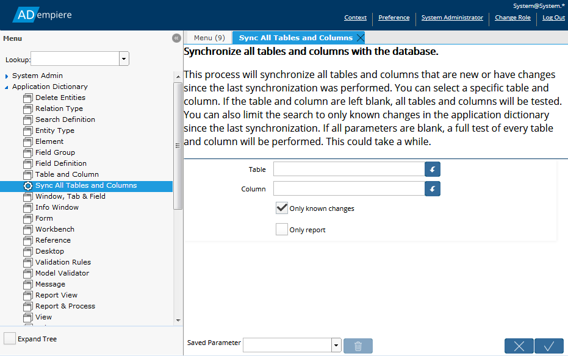

# Synchronizing Changes with the Database

## How to Synchronize Changes

Records in the Application Dictionary for Columns or Tables describe actual columns and tables in the database.  It is important that the Application Dictionary accurately reflects the structure of the database.  If it didn't the application may, for example,  try to access data from a column that doesn't exist. 

Every time you make a change in the Application Dictionary that affects a column or table definition, the changes have to be synchronized with the database.  There are three ways to do this:

1. On the **Column** tab of the **Tables and Columns** window, there is a button to _**Synchronize Column**_. Click this button to synchronize the column with the database.
2. In the **Application Dictionary**  Menu, run the process **Synchronize all Table and Columns**.
3. Set the System Configuration entry "DATABASE\_AUTO\_SYNC" to 'Y' \(or anything other than 'N'\).

| When you ... | Then ... |
| :--- | :--- |
| Click the _**Synchronize Column**_ button | The column will be synchronized with the database.  If the column is new, it will be added.  If the column already exists, it will be renamed, if necessary, and the appropriate constraints will be modified.  If the table does not exist in the database, the table will also be added. |
| Run the process **Synchronize all Tables and Columns** | Any table or column that needs to be synchronized will be. |
| Set the **System Configuration** entry "_DATABASE\_AUTO\_SYNC_" to '_Y_' | Every time you add or save a change to a column or table record, the change will be synchronized. |

### Using the Synchronize Column Button

When you add a table for the first time, a number of columns are automatically  added to the **Column** tab for that table.  You might also create columns of your own.  When you click the _**Synchronize Column**_ button, the application will check to see if the table exists in the database and, if not, will create the table and **all** the columns, not just the column shown in the **Column** tab.  If the table exists, only the current column is synchronized.

After the process has run, the results will display the DDL commands used to update the database.


If you are adding or changing  a number of columns in a table that has been synchronized in the past, you will have to synchronize each new or modified column in turn.


### Using the Process Synchronize All Tables and Columns

This process, found in the **Application Dictionary** menu, will synchronize every table or column that requires synchronization.  This is a convenient way to deal with a large number of changes and ensure that all changes are synchronized.  The process results will display the number of tables and columns updated as well as the DDL commands used to make the updates.

The process parameters allow you to select a single table or a single column to synchronize.  You can also choose to only synchronize "known" changes, meaning changes recognized by the ADempiere application.  Alternatively, the tables and columns will be checked against the database metadata and any differences will be corrected. If desired, the results can be reported before they are applied so you can verify the synchronization will be correct. 


If you choose to compare the application dictionary with the database for all tables and columns, please note that this will take some time.


### Using the System Configuration Entry

Open the **System Configuration** window and find the entry for "DATABASE\_AUTO\_SYNC".  To turn the Auto Sync function off, set the _**Value**_ to _N._ To turn it on, set the _**Value**_ to any other value, typically _Y_.

With the Auto Sync function on, any change to the column or table definition that requires synchronization will be synchronized when the record is saved.  The change will happen in the background and an error will be displayed if there is a problem.

This is an easy way to manage changes as the tables and columns created/changed are immediately available for use.

## Limitations

Generally, the synchronization works well with new columns and tables.  For other cases, the synchronization process is not perfect and may require some manual intervention.  Here are the cases to be aware of:

* Tables defined as a View will not be synchronized.
* Virtual Columns will not be synchronized.
* Creating a new table will also create its primary key if the table has a primary key and the key column name ends in "\_ID".
* Synchronizing a new table will also  synchronize any columns defined for the table.
* Synchronizing a column in a new table will also synchronize the table and all other columns in that table.
* Synchronizing a column in a previously synchronized table will only synchronize that column.
* Renaming a table with a single key will rename its primary key, the primary key element and associated constraints as long as the key column name ends in "\_ID"
* Synchronizing a column will set the column data type, default values and mandatory status.
* If a table has multiple keys, the keys and constraints will not be renamed when the table is renamed.
* If adding or renaming tables and columns from software,  commit the table changes first and use a different transaction for the columns, otherwise the table may be duplicated.
* When renaming a table or column, if a table or column with that name already exists in the database, an error will be thrown.  This is to prevent the possible loss of data in the existing table or column.
* Deleting a column or table from the Application Dictionary will not delete the corresponding item in the database.
* If an existing column is marked as _**Mandatory**_ and has no default, there may be errors when the column is synchronized if the existing column has null values.  This issue can be solved by specifying a default value in the **Column** tab of the **Table and Column**  window, synchronize the column, and then setting the default value to null and synchronize again.
* Changing the datatype of an existing column may cause error during synchronization if the column has data and the datatypes are not compatible. Manual intervention is required to convert the existing data to the new datatype.

    

